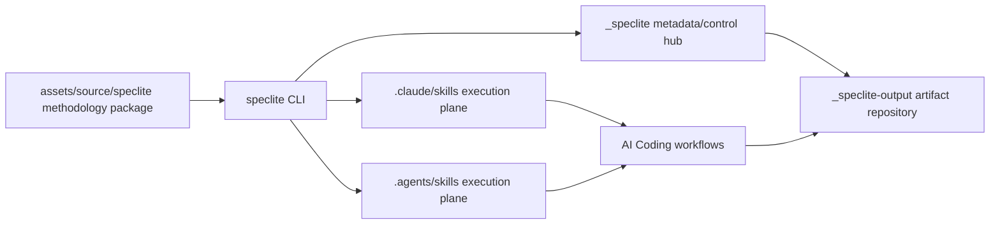

# SpecLite

SpecLite 是面向 AI IDE 时代的 local-first CLI control plane，用于把一套成熟的、适用于企业级生产项目的、参考敏捷研发流程的 AI Coding 落地方法论安装到本地项目和多个 AI IDE 中。

SpecLite 的 `assets/source/speclite/` 不是普通文档集合，而是一整套开箱即用的方法论源包：它包含核心交互能力、SDLC 分阶段 workflow skills、评审链路、运行时辅助脚本、默认 customization 示例，以及用于维护 canonical skill 源定义的支撑工具。SpecLite CLI 的职责，是把这些方法论资产转化为项目内可发现、可配置、可验证、可更新、可审查的本地执行系统。

## Audience（目标读者）

- 使用者：希望在项目中直接安装并使用 SpecLite AI Coding 方法论的团队成员。
- 开发者：需要理解 CLI、runtime、manifest、validation 和 IDE adapter 的实现者。
- 维护者：负责维护 canonical skills、fixtures、发布包和企业落地质量的人。

公开文档体系的导航入口是 [docs/index.md](https://github.com/flanliulf/SpecLite/blob/main/docs/index.md)。使用者从随 npm package 发布的 [docs/quick-start.md](docs/quick-start.md) 开始；开发者从 `docs/index.md` 的 Read First 开始；维护者阅读 `docs/README.md` 与 `docs/_STYLE_GUIDE.md`。

## What SpecLite Provides（SpecLite 提供什么）

SpecLite 提供的不是单个 prompt、单份 README 或零散 skill 文件，而是一套可治理的 AI Coding 方法论运行结构：

- `core-skills/`：多个 workflow 共享的基础能力，例如帮助、头脑风暴、文档索引、文档拆分、评审辅助、领域建模和术语治理。
- `sdlc-skills/`：按研发生命周期组织的方法论能力，覆盖分析、计划、方案设计、实现和 DevOps 发布阶段。
- `ecosystems/<category>/<id>/`：optional ecosystem modules，用于 React、Vue、Java / Spring Boot、Node.js、Python、npm package、CLI tool、documentation-only project 等具体技术生态或项目形态的 SpecLite Skill package selection。
- `support-skills/`：用于创建、迁移、检查和对齐 SpecLite canonical skill 源定义。
- `hooks/`：安装到 `_speclite/hooks/` 的 deterministic guardrails，例如 Flow Gate enforcement 和 canonical source change warnings。
- `scripts/`：共享 runtime helper scripts，例如 config/customization resolver。
- `custom/`：团队级和用户级 customization 示例。

安装后，目标项目通过本地 IDE skill directories 和 `_speclite` runtime 消费这些能力。

## Runtime Model（运行模型）

SpecLite 将方法论源包安装为项目内的本地运行系统：



核心边界：

- `_speclite/` 是 metadata/control hub。
- `.claude/skills/` 和 `.agents/skills/` 是 IDE execution plane。
- `_speclite-output/` 是 workflow artifacts repository。
- `assets/source/speclite/` 是 canonical methodology package source，不应被写成目标项目 runtime 依赖路径。

## Requirements（环境要求）

- Node.js `>=22`
- 推荐 Node.js 24 LTS
- local-first filesystem project
- MVP 不依赖数据库、后台服务或浏览器 UI

## Quick Start（快速开始）

详细安装和首次使用指南见 [docs/quick-start.md](docs/quick-start.md)。

通过 npm 使用已发布包：

```sh
npm install -g @fancyliu/speclite
speclite --version
speclite install /path/to/project
speclite install /path/to/project --yes
speclite status /path/to/project
speclite validate /path/to/project
```

无需全局安装时，可以用 `npx` 一次性运行：

```sh
npx @fancyliu/speclite@latest status /path/to/project
```

开发仓库内运行：

```sh
npm install
npm run build
npm run dev -- install /path/to/project
npm run dev -- install /path/to/project --yes
npm run dev -- status /path/to/project
npm run dev -- validate /path/to/project
```

机器可读输出：

```sh
speclite status /path/to/project --json
speclite validate /path/to/project --json
speclite governance-report /path/to/project --json
```

常用 flow 边界：

```sh
PROJECT_ROOT=/path/to/project

# read-only checks
NO_COLOR=1 speclite status "$PROJECT_ROOT"
NO_COLOR=1 speclite validate "$PROJECT_ROOT"

# prewrite previews
NO_COLOR=1 speclite install "$PROJECT_ROOT"
NO_COLOR=1 speclite update "$PROJECT_ROOT"
NO_COLOR=1 speclite update "$PROJECT_ROOT" --repair

# write-authorized and repair-authorized writes
NO_COLOR=1 speclite install "$PROJECT_ROOT" --yes
NO_COLOR=1 speclite update "$PROJECT_ROOT" --yes
NO_COLOR=1 speclite update "$PROJECT_ROOT" --repair --yes
```

这些 human-readable 示例用于帮助人工阅读和复制命令；`--json` 的 contract 以 schema、SPEC 和 focused tests 为准。

## Ecosystem Modules（生态模块）

默认安装仍只选择 `core` + `sdlc`。需要 React、Vue、Java / Spring Boot、Node.js、Python、npm package、CLI tool 或 documentation-only project 等额外方法论能力时，使用 interactive install：

```sh
speclite install /path/to/project --yes --interactive
```

interactive mode 会按 `ecosystem category -> id` 引导选择，例如先选 `frontend` / `backend` / `other`，再选 `react`、`java-springboot` 或 `npm-package`。选择 ecosystem modules 是推荐但非 mandatory；skip 是合法路径。

`--yes`、`--json`、default no-prompt install 不会自动选择 ecosystem modules。Ecosystem modules 是 SpecLite optional Skill package selection，不是项目依赖安装器、不是 package manager、不是 UI framework installer；SpecLite 不会安装 React / Vue / Java / npm package runtime dependencies（Node.js、Python 等生态同理），只把被选择的 SpecLite Skill packages 投影到 `.claude/skills/`、`.agents/skills/` 和 `_speclite/_config/*` indexes。

## CLI Commands（命令）

| Command | Purpose |
|---|---|
| `speclite install [target-directory]` | 执行安装 preflight，并在授权后写入 SpecLite runtime、skill mirrors、manifest/index 和输出目录。 |
| `speclite init [target-directory]` | 创建或重建项目 config plan，在授权后写入非冲突配置文件，并保护 human-owned custom files。 |
| `speclite list [target-directory]` | 列出 canonical modules、skills、IDE targets、版本和目标项目 installed-state 摘要。 |
| `speclite status [target-directory]` | 查看本地 SpecLite installed-state summary。 |
| `speclite validate [target-directory]` | 校验 installed-state、runtime path、manifest/index 和 IDE mirrors。 |
| `speclite doctor [target-directory]` | 执行比 `validate` 更丰富的诊断；远程 freshness/provenance revalidation 需要显式授权。 |
| `speclite update [target-directory]` | 生成或执行安全更新计划。 |
| `speclite update --repair [target-directory]` | 显式修复可安全恢复的 installer-owned canonical 内容。 |
| `speclite sync [target-directory]` | 对齐 installed source projections 和 IDE mirrors，不隐藏执行 repair 语义。 |
| `speclite uninstall [target-directory]` | 移除 installer-owned SpecLite 文件，并保留 human-owned 与 workflow-owned 路径。 |
| `speclite governance-report [target-directory]` | 基于 installed-state evidence 生成只读流程治理覆盖报告。 |
| `speclite resolve config` | Runtime support command，用于解析项目 config；默认 stdout 保持 pure JSON，可显式加 `--human` 查看排查用 support output。 |
| `speclite resolve customization` | Runtime support command，用于解析 skill customization；默认 stdout 保持 pure JSON，可显式加 `--human` 查看排查用 support output。 |
| `speclite resolve artifact-roots` | Runtime support command，用于按 lifecycle 解析 SPEC 09 effective artifact roots、resolution mode 与 provenance；默认 stdout 保持 pure JSON。 |
| `speclite resolve artifact-documents` | Runtime support command，用于解析 PRD / Epics / Architecture 的 whole / sharded document shape 与 `consumedPaths`；只读，默认 stdout 保持 pure JSON。 |
| `speclite resolve cr-directory` | Runtime support command，用于按 Story ID 解析唯一 Code Review 目录（`crDir`、`compatibilityMode`）；只读，默认 stdout 保持 pure JSON。 |

`resolve` 属于 runtime support API surface，主要服务已安装 skills，不是普通使用者的首要命令入口。未传 `--human` 时，missing key 仍输出 `{}`、exit code 为 `0`、stderr 为空，确保自动化和 installed skills 依赖的 contract 不变。已安装 Skill 激活前必须能在当前 AI 会话 `PATH` 中执行 `speclite`；不可用时应暴露或安装 Node CLI 后重试，不回退 Python resolver 或单独读取 `_speclite/config.toml`。安装后的治理和维护命令见 [docs/how-to/manage-installed-project.md](https://github.com/flanliulf/SpecLite/blob/main/docs/how-to/manage-installed-project.md)。

## Python Resolver Compatibility Assets（Python Resolver 兼容资产）

Fresh install 会把 `_speclite/scripts/resolve_*.py` 写入目标项目，并在 `files-index.json` 中标记为 `runtime-compat-script`。这些 Python scripts 只用于 legacy compatibility、migration aid 和 troubleshooting，不是默认 Skill activation path，也不是默认 CLI resolver runtime dependency。已安装 skills 的唯一默认 resolver 是 Node CLI：`speclite resolve config`、`speclite resolve customization`、`speclite resolve artifact-roots`、`speclite resolve artifact-documents` 和 `speclite resolve cr-directory`。

`install` 的默认 human-readable output 使用 `zh-CN`。`speclite install /path/to/project --yes` 是默认无交互安装；需要自定义 modules、config 或 IDE targets 时使用 `--yes --interactive`。安全预览会展示 target project、目标路径和命令执行目录，并让 `Next Actions` 使用可从原执行目录复制的 target。英文输出可用 `--locale en-US` 或 `SPECLITE_LOCALE=en-US`，JSON 输出不受 locale 影响，也不包含 human-only 的目标绝对路径上下文。

## Safety Model（安全模型）

SpecLite 的默认策略是保守写入、可审查变更：

- `--dry-run` 只生成 plan，不写文件；它适用于 `init`、`update`、`sync` 和 `uninstall`。`install` 不带 `--yes` 本身就是只读 preflight。
- `install` 不带 `--yes` 只执行 target preflight，不进入后续 source/module/config/write 阶段。
- `--yes` 只表示 command-level write authorization，不表示接受 unverified source 或 policy rejection。
- `init`、`sync` 和 `uninstall` 在未授权时只生成 plan；带 `--yes` 才执行非冲突写入或移除。
- `doctor --revalidate-source` 会记录 external access intent；未带 `--yes` 时不会执行远程 revalidation。
- Human-owned custom files 和 workflow-owned artifacts 不会被静默覆盖。
- Installer-owned files 更新前必须通过 ownership manifest 和 hash comparison。
- `install`、`init`、`update`、`repair`、`sync` 和 `uninstall` 写入前必须获取 `_speclite/.lock` project operation lock。
- Public report paths 使用 project-relative POSIX-style paths。

## Architecture Notes（设计说明）

SpecLite 是 CLI API + file-contract API，不是 REST、GraphQL 或 hosted service。

核心设计决策：

- Runtime Baseline：Node.js 22 LTS 是最低支持版本，Node.js 24 LTS 是推荐版本。
- CLI Foundation：TypeScript + commander。
- Storage Model：filesystem-first，MVP 不使用数据库。
- Runtime Boundaries：`_speclite` 是 control hub，IDE skill directories 是 execution plane，`_speclite-output` 是 artifact repository。
- Validation Model：`status`、`validate`、JSON output 和 fixture assertions 共享 deterministic issue model。
- Update Safety：写入前执行 ownership manifest + hash comparison。
- Post-MVP Governance：`doctor`、`sync`、`uninstall`、`init`、`list` 和 `governance-report` 复用既有 runtime、ownership、source root、`CommandResult` 和 `ValidationIssue` contract。

## Developer Workflow（开发者工作流）

```sh
npm install
npm run build
npm test
npm run release:check
```

| Script | Purpose |
|---|---|
| `npm run build` | 使用 `tsup` 构建 CLI。 |
| `npm run dev` | 通过 `tsx src/bin/speclite.ts` 运行开发入口。 |
| `npm test` | 运行 Vitest 测试。 |
| `npm run docs:check` | 校验 `docs/` 的链接、fragment、索引可达性、package 边界、Draft 状态和必要关系。 |
| `npm run release:packaging-check` | 只执行 packaging manifest 与打包边界检查，需先 `npm run build`。 |
| `npm run release:verify` | 构建并执行 packaging check，不运行测试。 |
| `npm run release:check` | 构建、运行 Vitest 并执行 packaging check，作为 publish 前门禁。 |

涉及 fixtures、canonical source、ecosystem modules、packaging manifest 或 release gates 的变更必须保持 build-first 串行验证：先运行 `npm run build`，再运行 focused tests / fixture gates / canonical source check，最后运行 `npm run release:packaging-check`。不要并行运行会读写 `dist/` 或 packaging manifests 的命令。

## Maintainer Notes（维护者说明）

维护 SpecLite 时，请区分三类内容：

- Canonical methodology package source：`assets/source/speclite/`
- CLI implementation：`src/`
- Planning and implementation artifacts：`_bmad-output/`

涉及 skill package、manifest、fixture、runtime path、validation issue model 或 release packaging 的变更，应同步检查对应 specs、fixtures 和 packaging verification。Optional ecosystem modules 不改变 default install guarantee；default fixture count 与 selected ecosystem fixture matrix 应分别维护。

CLI human-readable output 的 outcome/test/docs 覆盖矩阵见 [docs/reference/cli-human-output-matrix.md](https://github.com/flanliulf/SpecLite/blob/main/docs/reference/cli-human-output-matrix.md)。本节与 Developer Workflow 面向仓库贡献者；只使用 npm package 的读者可跳过。

## Roadmap（后续迭代路线）

以下是产品与 canonical source 的迭代路线；公开文档体系自身的整理项见 [docs/README.md](https://github.com/flanliulf/SpecLite/blob/main/docs/README.md) 的 Current Migration State（当前迁移状态）。

- [ ] 优化 canonical source skills 目录结构，包括输出 Artifacts 目录、文档命名规范和顺序可读性等。
- [ ] 支持既有项目多次迭代的 `_speclite-output` 体系。
- [ ] 支持微服务体系的跨多仓库迭代开发体系。
- [ ] 将 Grill 能力无痕融合到核心流程 Skills，并增强 debugging 等核心能力 Skills。
- [ ] 遵循新的 doc system 体系，重构 canonical source skills。
- [ ] 增强既有项目的 project knowledge 体系。
- [ ] 整体优化 UX 体系。
- [ ] 支持测试架构体系模块（TEA）。
- [ ] 支持 CI/CD 能力。
- [ ] 支持代码工程化风格能力，以及代码简化和代码重构 skills。
- [ ] 支持企业级定制化代码规范，以及实现风险左移的流程。
