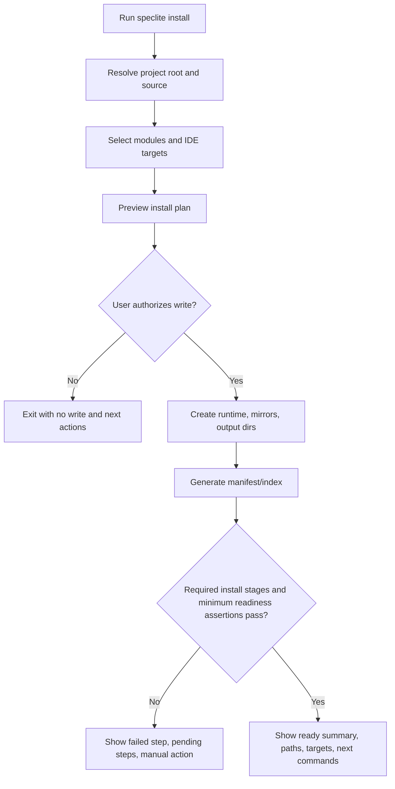
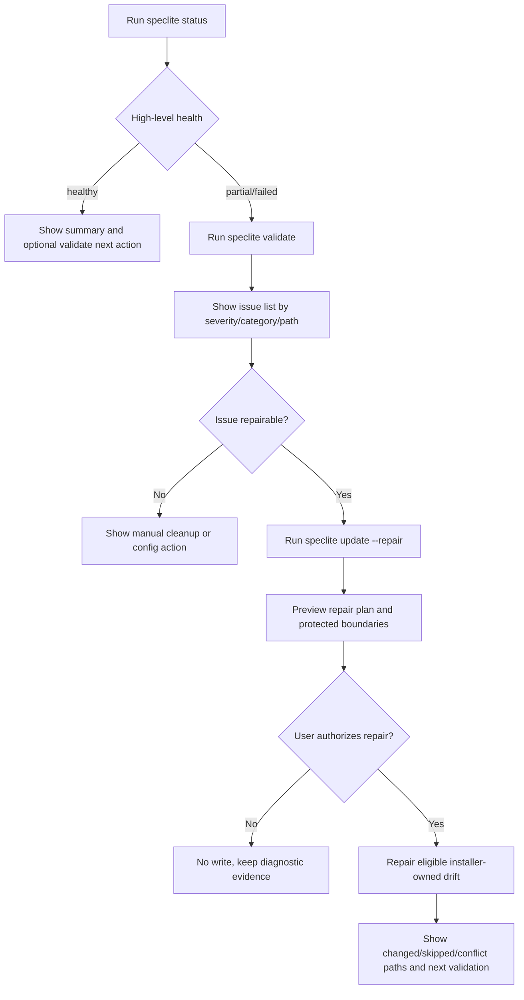
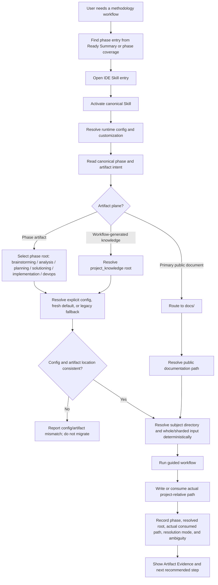
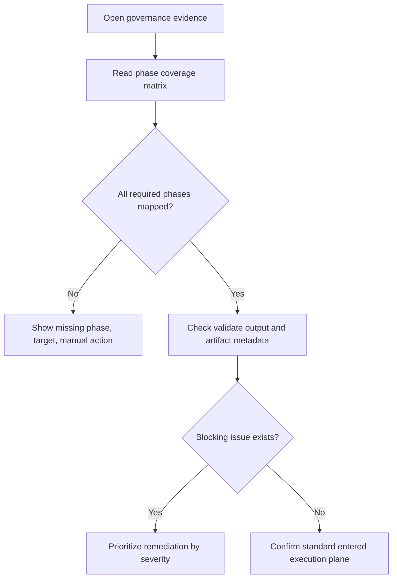

---
stepsCompleted:
  - 1
  - 2
  - 3
  - 4
  - 5
  - 6
  - 7
  - 8
  - 9
  - 10
  - 11
  - 12
  - 13
  - 14
lastStep: 14
inputDocuments:
  - "_bmad-output/planning-artifacts/product-brief-SpecLite.md"
  - "_bmad-output/planning-artifacts/product-brief-SpecLite-distillate.md"
  - "_bmad-output/project-context.md"
  - "_bmad-output/planning-artifacts/prd/index.md"
  - "_bmad-output/planning-artifacts/prd/01-executive-summary执行摘要.md"
  - "_bmad-output/planning-artifacts/prd/02-project-classification项目分类.md"
  - "_bmad-output/planning-artifacts/prd/03-success-criteria成功标准.md"
  - "_bmad-output/planning-artifacts/prd/04-product-scope产品范围.md"
  - "_bmad-output/planning-artifacts/prd/05-user-journeys用户旅程.md"
  - "_bmad-output/planning-artifacts/prd/06-domain-specific-requirements领域特定需求.md"
  - "_bmad-output/planning-artifacts/prd/07-innovation-novel-patterns创新与新模式.md"
  - "_bmad-output/planning-artifacts/prd/08-developer-tool-specific-requirements开发者工具特定需求.md"
  - "_bmad-output/planning-artifacts/prd/09-project-scoping-phased-development项目范围界定与阶段化开发.md"
  - "_bmad-output/planning-artifacts/prd/10-functional-requirements功能需求.md"
  - "_bmad-output/planning-artifacts/prd/11-non-functional-requirements非功能需求.md"
  - "_bmad-output/planning-artifacts/architecture/index.md"
  - "_bmad-output/planning-artifacts/architecture/01-project-context-analysis项目上下文分析.md"
  - "_bmad-output/planning-artifacts/architecture/02-starter-template-evaluationstarter-模板评估.md"
  - "_bmad-output/planning-artifacts/architecture/03-core-architectural-decisions核心架构决策.md"
  - "_bmad-output/planning-artifacts/architecture/04-implementation-patterns-consistency-rules实现模式与一致性规则.md"
  - "_bmad-output/planning-artifacts/architecture/05-project-structure-boundaries项目结构与边界.md"
  - "_bmad-output/planning-artifacts/architecture/06-architecture-validation-results架构验证结果.md"
  - "_bmad-output/planning-artifacts/epics/index.md"
  - "_bmad-output/planning-artifacts/epics/01-overview概览.md"
  - "_bmad-output/planning-artifacts/epics/02-requirements-inventory需求清单.md"
  - "_bmad-output/planning-artifacts/epics/03-epic-listepic-列表.md"
  - "_bmad-output/planning-artifacts/epics/04-epic-1-project-installation-onboarding项目安装引导.md"
  - "_bmad-output/planning-artifacts/epics/05-epic-2-methodology-discovery-and-skill-execution方法论发现与-skill-执行.md"
  - "_bmad-output/planning-artifacts/epics/06-epic-3-installed-state-and-deterministic-validation已安装状态与确定性验证.md"
  - "_bmad-output/planning-artifacts/epics/07-epic-4-safe-update-and-repair安全更新与修复.md"
  - "_bmad-output/planning-artifacts/epics/08-epic-5-source-integrity-and-distribution-channels来源完整性与分发渠道.md"
  - "_bmad-output/planning-artifacts/epics/09-epic-6-maintainer-fixture-and-release-confidence维护者-fixture-与发布信心.md"
  - "_bmad-output/planning-artifacts/epics/10-epic-7-post-mvp-governance-expansionpost-mvp-治理扩展.md"
  - "_bmad-output/planning-artifacts/epics/11-epic-8-cli-outcome-oriented-human-output-systemcli-outcome-导向人类输出体系.md"
  - "_bmad-output/planning-artifacts/epics/12-epic-9-installed-runtime-activation-contract-hardening已安装-runtime-激活契约收口.md"
  - "_bmad-output/planning-artifacts/epics/13-epic-10-canonical-source-ecosystem-module-governancecanonical-source-生态模块治理.md"
  - "_bmad-output/planning-artifacts/epics/14-epic-11-phase-aligned-workflow-artifact-governance阶段对齐的-workflow-artifact-治理.md"
  - "docs/index.md"
revisionSource: "_bmad-output/planning-artifacts/sprint-change-proposal-2026-08-17.md"
revisionStatus: "complete"
revisionItemsCompleted:
  - "architecture-solutioning-subject-root"
  - "architecture-whole-sharded-discovery-evidence"
  - "existing-install-legacy-compatible-no-migration"
  - "dynamic-module-count-example"
revisionUpdatedAt: "2026-08-18"
revisionCompletedAt: "2026-08-18"
---

# UX Design Specification（UX 设计规格）：SpecLite

**Author（作者）：** Fancyliu
**Date（日期）：** 2026-05-25

---

<!-- UX design content will be appended sequentially through collaborative workflow steps. -->

## Executive Summary（执行摘要）

### Project Vision（项目愿景）

SpecLite 是面向 AI IDE 时代的本地研发方法论安装与治理控制面。它将分散在 Markdown、prompt、agent、skill 和人工约定中的 For AI 研发方法论，转化为可安装、可发现、可验证、可更新、可审查的本地工程系统。

从 UX 角度看，SpecLite 的核心体验不是传统 GUI 体验，而是 CLI + 文件系统控制面体验。用户真正需要的不是“看见一个界面”，而是在安装、使用、诊断和更新过程中始终理解系统正在做什么、会写入哪里、哪些内容受保护、哪些问题需要人工处理，以及下一步应该怎么做。

### Target Users（目标用户）

SpecLite 的一等用户包括：

- 技术负责人：希望在团队项目中一次性安装 SpecLite，并让多个 AI IDE 暴露一致的方法论入口。
- 企业规范负责人：需要通过阶段覆盖矩阵、validate 输出和过程产物判断研发规范是否真正进入团队执行现场。
- AI IDE 使用者：希望按研发阶段选择对应 skill，并让 SPEC、方案、故事、实现、测试和审查产物写入可预测位置。
- 工具链维护者：需要诊断 IDE mirror drift、manifest/index 问题、runtime path 错误、legacy namespace residue 和文件完整性问题。
- 方法论维护者：需要证明新增或修改的 source skill 可以被安装、索引、镜像、发现、激活并产出预期 artifact。

### Key Design Challenges（关键设计挑战）

1. CLI 需要同时服务交互用户和自动化用户。Human-readable output 必须清晰可读，`--json` output 必须稳定、可解析、可作为 fixture 和 CI 契约。
2. 安装与更新涉及多个文件所有权边界。UX 必须让用户明确区分 installer-owned、human-owned 和 workflow-owned 文件，避免“工具会不会覆盖我东西”的不信任。
3. 诊断信息天然复杂。`status`、`validate`、`update` 需要把 manifest、IDE mirrors、runtime path、artifact path、source integrity 和 file integrity 转化为可操作的问题摘要与下一步动作。
4. 多 AI IDE 会制造入口漂移。UX 需要让用户理解 canonical skill、IDE target、entry path 和 activation target 之间的关系，而不是暴露一堆底层路径。
5. SpecLite 是 local-first control plane，没有 Web UI。产品的可用性主要由命令流程、输出结构、文件布局、错误文案和文档示例共同承担。

### Design Opportunities（设计机会）

1. 把安装过程设计成可审查的阶段化旅程：source discovery、manifest generation、IDE mirror creation、config initialization 和 minimum readiness verification 每一步都有明确状态。
2. 把诊断设计成“问题 -> 影响 -> 建议动作”的工作流，而不是原始错误堆栈，让工具链维护者能快速判断是否需要 repair、manual cleanup 或重新配置。
3. 把文件所有权模型转化为用户信任体验：默认保护 human-owned custom files 和 workflow-owned artifacts，并在 update plan 中显式展示 changed、skipped 和 conflict paths。
4. 把跨 IDE 一致性设计成可见承诺：通过阶段覆盖矩阵、canonical skill id、IDE target status 和 entry path，让用户看到方法论是否真的进入执行现场。
5. 把 fixture 和 expected output 也视为 UX 资产：维护者通过稳定示例理解系统行为，减少实现、测试和文档之间的歧义。

## Core User Experience（核心用户体验）

### Defining Experience（定义性体验）

SpecLite 的核心体验是：用户在终端运行一个明确命令，系统把本地项目中的方法论安装状态、IDE 入口、文件写入计划、验证问题和下一步动作解释清楚，并以可审查的文件系统结果留下证据。

最关键的用户动作不是单一的 `install`，而是“运行命令 -> 理解系统状态 -> 信任下一步动作”。`install` 建立入口，`status` 建立摘要，`validate` 建立诊断，`update` / `update --repair` 建立安全演进；这些命令共同构成 SpecLite 的核心控制面体验。

### Platform Strategy（平台策略）

SpecLite 的主要平台是 terminal + local filesystem。用户主要通过键盘和 shell 使用产品，产物通过项目目录、IDE skill mirrors、manifest/index、validate output 和 workflow artifacts 被检查和复用。

MVP 不设计传统 Web、mobile 或 desktop GUI。UX 需要优先优化 CLI 输出、命令参数、路径展示、文件布局、JSON contract、错误诊断和文档示例。离线可用、本地确定性和跨 macOS/Windows 的稳定路径展示是平台体验的一部分。

### Effortless Interactions（低摩擦交互）

以下交互应尽量不让用户思考：

1. 安装后立即知道是否 ready，以及下一步如何在 AI IDE 中使用 SpecLite。
2. 看到路径时能判断它属于 Metadata / Control Plane、IDE Execution Plane、Phase Artifact Plane、Project Knowledge Plane，还是 Public Documentation Plane。
3. 运行 `status` 时快速得到安装来源、版本、IDE 覆盖和 high-level health，而不被完整验证噪音打断。
4. 运行 `validate` 时看到稳定排序的问题、影响范围和建议动作。
5. 运行 `update` 时先看到写入计划，并明确哪些文件会 changed、skipped 或 conflict。
6. 自动化用户通过 `--json` 获得稳定结构，不需要解析 human-readable 文案。

### Critical Success Moments（关键成功时刻）

1. Fresh install 完成后，用户看到 ready summary，并能在 `.claude/skills` 与 `.agents/skills` 中找到一致的入口。
2. 企业规范负责人看到阶段覆盖矩阵，能确认 SPEC、方案评审、故事规划、实现、测试和审查阶段是否存在 mapped skill entry。
3. 工具链维护者运行 `validate` 后，能从 issue id、category、affected path 和 suggested next step 判断问题应如何处理。
4. 用户运行 `update` 时，系统没有覆盖 human-owned custom files 或 workflow-owned artifacts，而是显式报告 conflict 或 skipped path。
5. 方法论维护者通过 fixture 和 expected output 证明新增 skill 可安装、可发现、可激活、可产出 artifact。

### Experience Principles（体验原则）

1. Plan before write：任何可能改变项目文件的动作，都先展示计划、影响和授权边界。
2. Evidence over optimism：不要只说“成功”，要展示 manifest、IDE targets、paths、completed steps、issues 或 artifacts 作为证据。
3. Protect user work by default：human-owned custom files 和 workflow-owned artifacts 默认受保护，无法确认安全时宁可 conflict，不静默覆盖。
4. One methodology, many IDEs：UX 要把 canonical skill 与多个 IDE target 的映射解释清楚，避免用户感知到能力漂移。
5. Human-readable and machine-readable are peers：面向人的输出要可理解，`--json` 输出要可契约化，二者共享同一诊断语义。

## Desired Emotional Response（期望情绪响应）

### Primary Emotional Goals（主要情绪目标）

SpecLite 应让用户感到信任、掌控和清醒。它处理的是本地项目文件、AI IDE 执行入口、更新保护和规范落地证据，因此情绪目标不是惊喜或娱乐，而是“我知道它在做什么，并且它不会越界”。

对技术负责人和企业规范负责人来说，核心情绪是可审查的安心：他们能够看到方法论是否被安装、是否覆盖关键阶段、是否能被团队执行。对工具链维护者来说，核心情绪是可操作的冷静：问题不再是模糊失败，而是有 issue id、影响范围和下一步动作的诊断结果。对 AI IDE 使用者来说，核心情绪是顺手：在正确阶段找到正确 skill，产物落到正确位置。

### Emotional Journey Mapping（情绪旅程映射）

初次接触时，用户应感觉 SpecLite 是一个严肃、克制、可解释的本地工具，而不是会随意改动项目的黑盒脚本。

运行 `install` 时，用户应从谨慎转向安心：每个阶段都有明确状态，ready summary 只在真正就绪后出现。

运行 `status` 时，用户应快速获得方向感：当前安装状态、来源、版本、IDE targets 和 high-level health 一眼可判断。

运行 `validate` 时，用户应从困惑转向清楚：问题被稳定分类、排序，并且能看到影响和建议动作。

运行 `update` 或 `update --repair` 时，用户应感到系统尊重边界：先计划、再授权；能修复的修复，不能安全确认的明确 conflict；不静默覆盖用户定制和过程产物。

回到产品再次使用时，用户应形成稳定预期：命令输出、文件路径、JSON contract 和 artifact 位置都可重复、可审查、可自动化。

### Micro-Emotions（微情绪）

- Confidence over confusion：命令输出要减少猜测，让用户知道当前状态和下一步。
- Trust over skepticism：每个写入动作都要有边界说明和证据支撑。
- Calm over anxiety：错误和冲突不应制造恐慌，应以稳定 issue model 呈现。
- Accomplishment over busywork：安装、验证和更新完成后，用户应看到可验证结果，而不是只看到“done”。
- Accountability over magic：SpecLite 不追求神奇自动化，而是追求可解释、可复现、可审查。

### Design Implications（设计影响）

1. 输出文案要克制、具体、可操作，避免夸张成功语气。
2. 所有危险动作都需要体现 plan-before-write，尤其是 `install`、`update` 和 `update --repair`。
3. `status` 要保持轻量，避免把用户拖入完整验证细节。
4. `validate` 的情绪设计重点是消除模糊性：稳定 category、issue id、affected path、impact 和 suggested next step。
5. 文件路径展示要帮助用户形成五空间模型：Metadata / Control、IDE Execution、Phase Artifact、Project Knowledge 与 Public Documentation 各自是什么，不能把 `docs/` 与 workflow-generated project knowledge 合并解释。
6. 对企业规范负责人，阶段覆盖矩阵和过程产物证据要能带来“标准真的进入执行现场”的确认感。
7. 对自动化用户，`--json` 的稳定性本身就是情绪体验：它减少 CI、fixture 和企业集成中的不确定性。

### Emotional Design Principles（情绪设计原则）

1. Be explicit before being helpful：先说清楚将做什么、影响哪里，再提供便利动作。
2. Make safety visible：保护用户文件不是隐藏实现细节，而是需要在 update plan、conflict 和 skipped path 中可见。
3. Treat diagnostics as guidance：诊断输出不是报错列表，而是帮助用户恢复掌控的路径。
4. Reward verification：成功状态应附带证据，让用户能把结果交给团队、CI 或治理流程复核。
5. Keep the tool sober：SpecLite 的语气应专业、稳定、低噪音，符合本地研发控制面的职责。

## UX Pattern Analysis & Inspiration（UX 模式分析与灵感）

### Inspiring Products Analysis（启发产品分析）

主要参考对象是 [BMAD-METHOD](https://github.com/bmad-code-org/BMAD-METHOD) 与 [BMAD Method docs](https://docs.bmad-method.org/)。它值得借鉴的不是视觉样式，而是 AI-assisted SDLC 工具如何把复杂方法论变成可执行、可导航、可复用的本地 workflow 体验。

BMAD-METHOD 的关键 UX 优点包括：

1. 一条命令进入系统：`npx bmad-method install` 把首次安装、升级、模块选择和 IDE 集成放进统一入口，降低用户开始成本。
2. 明确的下一步引导：`bmad-help` 不要求用户记住完整 workflow，而是根据当前项目与已安装模块告诉用户下一步该做什么。
3. 阶段化工作流地图：Analysis、Planning、Solutioning、Implementation 四阶段把复杂研发过程变成可理解路径，每个 workflow 都有明确目的和输出产物。
4. 交互式与非交互式并存：交互安装适合人类首次配置，headless/CI flags 适合企业 rollout 和自动化复现。
5. 文件系统心智模型清晰：`_bmad` 承载配置与方法论执行资产，`_bmad-output` 承载 planning、implementation、project context 等产物。
6. 模块化扩展路径明确：official modules、custom/community modules 和 builder 体系让用户理解能力如何增长，而不是把所有能力塞进单一工具。

### Transferable UX Patterns（可迁移 UX 模式）

1. Guided next step pattern：SpecLite 应在 `install` ready summary、`status` 和 `validate` 结果中持续告诉用户“下一步做什么”，而不是只报告当前状态。
2. Phase map as navigation：SpecLite 的阶段覆盖矩阵不应只是治理报告字段，也应成为用户理解方法论入口的导航模型。
3. Dual-mode command design：每个核心命令都要同时考虑 human-readable flow 和 `--json` automation flow，避免后期补自动化接口。
4. Filesystem as interface：目录结构本身就是 UX。Metadata / Control、IDE Execution、Phase Artifact、Project Knowledge 与 Public Documentation 五个 planes 需要在输出、文档和示例中持续保持同一套空间语言。
5. Help without memorization：SpecLite 不应要求用户记住所有 command、phase、skill 和 target id；关键输出应暴露可选项、推荐动作和验证命令。
6. Artifact-backed progress：每个 workflow 或命令完成后，都应留下可复核 artifact、manifest/index 投影或 structured output，而不是只给 transient terminal message。

### Anti-Patterns to Avoid（应避免的反模式）

1. 只有安装入口，没有状态闭环：如果用户安装后必须自己翻目录确认结果，控制面信任会下降。
2. 把帮助文档当作主要导航：当用户必须查文档才能知道下一步，CLI/control-plane 体验就没有闭环。
3. 交互流程和 CI 流程割裂：如果 interactive install 与 headless install 语义不同，企业 rollout 和 fixture 会变脆弱。
4. 目录名存在但语义不稳定：如果五个 planes 的职责边界不在输出中反复强化，用户会把 runtime metadata、IDE execution、phase artifacts、workflow-generated project knowledge 与 public docs 混在一起。
5. 只强调 AI workflow，不暴露治理证据：SpecLite 的一等用户包括企业规范负责人，因此不能只优化“开发者顺手”，还要优化“标准是否落地”的可审查体验。

### Design Inspiration Strategy（设计灵感策略）

SpecLite 应吸收 BMAD-METHOD 的“方法论可执行化”经验，但将重点从 workflow coaching 推进到 installer/control-plane governance。

采用：

- 一条命令进入系统，并在完成后明确下一步。
- 阶段化方法论地图，让用户知道每个 skill 属于哪个研发阶段。
- 项目目录作为产品界面，所有关键目录都有稳定职责。
- 交互式和自动化两套入口共享同一语义。

调整：

- BMAD 的 `bmad-help` 模式可转化为 SpecLite 的 ready summary、`status.nextActions`、`validate.suggestedNextStep` 和阶段覆盖矩阵导航，而不是直接新增一个泛化聊天入口。
- BMAD 的 `_bmad` / `_bmad-output` 模型可迁移为 `_speclite` / `_speclite-output`，但 SpecLite 还必须额外强调 IDE execution plane 和 manifest/index governance。
- BMAD 的 workflow artifact 导向应扩展为 SpecLite 的 artifact + manifest + validation issue + fixture evidence 四类证据。

避免：

- 不把 SpecLite 做成“又一套 BMad workflow 菜单”。SpecLite 的差异化是安装治理、跨 IDE 一致性、文件所有权保护和可验证更新。
- 不复制 BMAD 的全部产品语气。SpecLite 应更克制、更审计友好、更关注安全边界。
- 不把 module ecosystem 早早前置成主体验。MVP 应先把 install -> status -> validate -> update 的控制面闭环打磨清楚。

## Design System Foundation（设计系统基础）

### 1.1 Design System Choice（设计系统选择）

SpecLite 不采用传统 GUI component library 作为 MVP 设计系统基础。它的设计系统应定义为 Contract-first CLI Output Design System（契约优先的 CLI 输出设计系统）。

这个设计系统的核心组件不是按钮、卡片或页面布局，而是 command output primitives、路径展示规则、状态词汇、诊断结构、阶段进度、next actions、文件系统空间模型、human-readable 与 `--json` 的语义对齐。

### Rationale for Selection（选择理由）

SpecLite 的主要平台是 terminal + local filesystem，MVP 不提供 Web、mobile 或 desktop GUI。采用 Material Design、Ant Design、MUI 或 Chakra UI 这类视觉组件系统，会把设计重点错误地拉向图形界面。

更合适的基础是围绕以下产品真实界面建立一致性：

- CLI human-readable output
- `CommandResult` JSON envelope
- `ValidationIssue` diagnostics
- manifest/index 文件
- install/update plan
- phase coverage matrix
- fixture expected outputs
- documentation examples

这种设计系统能直接服务 SpecLite 的情绪目标：信任、掌控、清醒、可审查。

### Implementation Approach（实现方式）

MVP 应定义一组稳定输出模式：

1. Summary block：每个核心命令都先给稳定摘要，说明当前状态和关键结论。
2. Progress steps：`install`、`validate`、`update` 使用稳定 step id 与人类可读 label。
3. Path table：路径统一使用 project-relative POSIX path，并标注所属 plane、phase、resolved root、resolution mode 与 ownership；五类 plane 固定为 Metadata / Control、IDE Execution、Phase Artifact、Project Knowledge 与 Public Documentation。
4. Issue list：诊断问题统一展示 severity、category、issue id、affected path、impact、suggested next step。
5. Plan before write：写入型命令必须先展示 planned effects、changed paths、skipped paths、conflicts 和 authorization boundary。
6. Next actions：每个命令输出都应给 command-specific priority order 的下一步动作。
7. JSON parity：human-readable output 与 `--json` 不必同形，但必须共享同一状态、issue 和路径语义。

### Customization Strategy（定制策略）

SpecLite 的定制策略不应从视觉 theme 开始，而应从组织可治理的输出规则开始：

- 语气保持克制、准确、低噪音，避免营销化成功文案。
- 状态词汇保持有限集合，避免同义词漂移。
- 路径展示始终帮助用户理解文件所有权和 runtime boundary。
- 企业/CI 场景优先保证 `--json` 稳定，不让 human-readable 文案成为自动化依赖。
- 文档示例、fixture expected outputs 和 CLI 输出应共享同一套结构语言。
- 未来如果加入 GUI 或 dashboard，也必须继承这些 CLI/control-plane primitives，而不是重新发明状态、诊断和路径语义。

## 2. Core User Experience（核心用户体验）

### 2.1 Defining Experience（定义性体验）

SpecLite 的定义性体验是：用户运行一个核心命令后，系统把“当前状态、证据、风险、写入边界、下一步动作”一次性解释清楚，并把结果落到可审查的本地文件系统契约中。

一句话描述：Run a command, see the truth, trust the next action.

这不是传统 GUI 的点击体验，也不是单纯的安装成功体验。它是一个本地控制面交互：用户通过 `install` 建立系统，通过 `status` 获得方向，通过 `validate` 识别问题，通过 `update` / `update --repair` 安全演进，通过 IDE skill mirrors 和 `_speclite-output` 看到方法论进入执行现场。

### 2.2 User Mental Model（用户心智模型）

用户带来的初始心智模型通常是“安装器会复制文件到项目里”。SpecLite 需要把这个心智模型升级为“由五个空间组成、可审查的本地方法论控制面”。

1. Metadata / Control Plane（元数据与控制平面）
   - 典型位置：`_speclite/`。
   - 承载 config、manifest/index、source descriptor、installed state 和 runtime scripts。
   - 主要由 installer 管理，不存放 workflow artifacts 或公共项目文档。

2. IDE Execution Plane（IDE 执行平面）
   - 典型位置：`.claude/skills/`、`.agents/skills/`。
   - 承载 IDE 可发现、可激活的 canonical Skill projections。
   - 可由 installer 重新投影，不是 canonical source，也不是 workflow artifact repository。

3. Phase Artifact Plane（阶段产物平面）
   - fresh install 默认包含 `_speclite-output/0-brainstorming-artifacts/`、`_speclite-output/1-analysis-artifacts/`、`_speclite-output/2-planning-artifacts/`、`_speclite-output/3-solutioning-artifacts/`、`_speclite-output/4-implementation-artifacts/` 与 `_speclite-output/5-devops-artifacts/`。
   - workflow 根据 phase、artifact kind 和 resolved runtime root 写入对应位置。
   - ordinary install、update 和 `update --repair` 不迁移或重写既有 workflow-owned artifacts。

4. Project Knowledge Plane（项目知识平面）
   - fresh install 默认位置：`_speclite-output/project-knowledge-base/`。
   - 承载 workflow-generated project knowledge。
   - 不包含 domain、market、technical research、Product Brief 或 PRFAQ；这些属于 Analysis producers。

5. Public Documentation Plane（公共文档平面）
   - 典型位置：`docs/`。
   - 是 Primary Public Document，面向项目读者和维护者。
   - 不得与 workflow-generated project knowledge 或阶段产物根合并解释。

existing install 的显式配置继续权威。新增 runtime field 缺失时，系统可以使用定义好的 legacy fallback，但必须展示实际 resolved root，并标记 `legacy-compatible`；fallback 不是 artifact migration。

用户应能从任何 Filesystem Space Map、Ready Summary、diagnostic 或 artifact evidence 中判断：当前路径属于哪个 plane 和 phase，使用的是 fresh default、explicit config 还是 legacy fallback，workflow 实际消费了哪个路径，哪些内容由 installer 管理、哪些属于 workflow 或人类，以及 config 与既有 artifact 位置不一致时是否需要人工处理。

### 2.3 Success Criteria（成功标准）

核心体验成功时，用户会说：“我知道 SpecLite 现在处于什么状态，也知道下一步是否安全。”

成功指标包括：

1. Fresh install 后，用户能立即看到 ready summary、installed modules、IDE targets、关键路径和下一步命令。
2. `status` 能在轻量输出中给出 high-level health，而不制造完整验证噪音。
3. `validate` 能把问题稳定映射到 category、issue id、affected path、impact 和 suggested next step。
4. `update` 先展示 planned effects，并清楚区分 changed、skipped、conflicts。
5. 用户能从输出判断文件所属空间和所有权边界。
6. 企业规范负责人能从阶段覆盖矩阵和 artifact evidence 判断标准是否进入执行现场。
7. CI/fixture 用户能通过 `--json` 获得与 human-readable output 语义一致的稳定结构。

### 2.4 Novel UX Patterns（新型 UX 模式）

SpecLite 使用的基础模式是 established CLI patterns：命令、摘要、进度、表格、退出码、JSON 输出、文档示例。但它的组合方式是新的：把 CLI 输出、文件系统契约、manifest/index、diagnostics、artifact evidence 和 multi-IDE skill discovery 统一成一个控制面体验。

需要重点设计的 novel patterns 包括：

1. Filesystem control-plane map：用五个 plane、phase/root、resolution mode 和 ownership 解释 Metadata / Control、IDE Execution、Phase Artifact、Project Knowledge 与 Public Documentation 的职责。
2. Governance-aware ready summary：安装完成不是只说 done，而是展示可治理证据和下一步动作。
3. Validation issue as recovery instruction：每个 issue 不只是错误，而是可执行的恢复建议。
4. Phase coverage as navigation and audit：阶段覆盖矩阵既帮助用户找 skill，也帮助企业规范负责人审查落地情况。
5. Repair as explicit trust boundary：`update --repair` 不是普通 update 的隐藏模式，而是明确授权的恢复动作。

这些模式都应通过熟悉的 CLI 结构呈现，避免创造需要学习的新交互语法。

### 2.5 Experience Mechanics（体验机制）

**1. Initiation（启动）**

用户通过明确命令进入体验：

- `speclite install`
- `speclite status`
- `speclite validate`
- `speclite update`
- `speclite update --repair`
- `speclite resolve config`
- `speclite resolve customization`

命令名应承担清楚意图：读取状态、完整验证、计划更新、显式修复、解析配置，不混用职责。

**2. Interaction（交互）**

人类用户通过 prompt、flag、summary、table 和 next actions 与系统互动。自动化用户通过 `--json`、exit code、stable schema 和 fixture snapshots 与系统互动。

写入型命令必须先产生计划，再进入授权与执行；读取型命令必须保持只读语义，尤其是 `status` 和 `validate`。

**3. Feedback（反馈）**

反馈由四层构成：

- Immediate terminal summary：让用户快速知道结果。
- Structured details：通过表格或列表展示路径、targets、issues、steps。
- File evidence：manifest/index、installed state、artifact metadata、fixture expected outputs。
- JSON contract：给 CI、企业自动化和测试稳定消费。

**4. Error and Conflict Handling（错误与冲突处理）**

错误不应以 raw stack trace 作为主要体验。系统应输出 stable issue id、severity、category、affected path、impact、suggested next step。

冲突不是失败文案的末端，而是安全边界的可见化：当系统无法确认写入安全时，应说明为什么 skipped 或 conflict，以及用户能如何验证或手动处理。

**5. Completion（完成）**

完成状态必须带证据：

- `install` 完成于 ready summary + installed paths + IDE targets + next commands。
- `status` 完成于 high-level health + source/version/target summary。
- `validate` 完成于 checked categories + issue counts + actionable issues。
- `update` 完成于 changed/skipped/conflict paths + next actions。
- workflow 完成于 artifact path + metadata + 可复用输入位置。

完成后，用户应该知道：我现在处于什么状态，系统写了什么，没有写什么，下一步做什么。

## Visual Design Foundation（视觉设计基础）

### Color System（颜色系统）

SpecLite 的 MVP 颜色系统以 terminal semantic color 为基础，而不是品牌视觉色板。颜色只用于增强扫描效率，不承担唯一语义；所有状态必须在无颜色环境中仍可通过文本、字段和排序被理解。

建议语义：

- Success：用于 ready、valid、completed、applied 等状态。
- Warning：用于 non-blocking warning、manual review、unverified source 等状态。
- Error：用于 blocking error、conflict、invalid、failed write 等状态。
- Info：用于 discovered、checked、skipped、not-configured、next action 等状态。
- Muted：用于辅助说明、路径上下文、说明性提示。

颜色使用原则：

1. 不用颜色替代 `status`、`severity`、`issueId`、`category` 或 path。
2. `--json` 不输出颜色控制字符。
3. Human-readable output 可支持 TTY color，但必须在 `NO_COLOR`、非 TTY、CI 环境中保持纯文本可读。
4. 颜色数量保持克制，避免把 CLI 输出变成仪表盘视觉噪音。
5. 文档示例默认使用无颜色文本，确保可复制、可 snapshot、可审查。

### Typography System（排版系统）

SpecLite 的排版系统依赖用户终端等宽字体。设计重点不是选择字体，而是建立稳定文本层级。

建议层级：

- Command title：命令名 + 高层状态，例如 `speclite validate: completed with errors`。
- Summary：1-3 行解释当前结论，避免长段叙述。
- Section heading：稳定栏目名，例如 `Summary`、`Checked`、`Issues`、`Paths`、`Next actions`。
- Table/list content：用于 modules、targets、paths、issues、planned effects。
- Detail text：用于 impact、suggested next step、manual action。
- Raw value：路径、issue id、target id、schema version、hash 摘要等始终使用 monospace/code 样式。

排版原则：

1. 先摘要，后细节；先结论，后证据。
2. 每个命令输出的栏目顺序稳定，方便人类记忆和文档对照。
3. 避免长行；路径可换行或缩进，但 machine-readable 输出必须保留完整字段。
4. 长解释进入文档，命令行只给足够行动的信息。
5. 技术标识保持英文原样，说明文字使用中文或配置语言。

### Spacing & Layout Foundation（间距与布局基础）

SpecLite 的布局应偏 dense and scannable（紧凑且可扫描），符合 CLI/control-plane 使用场景。不要追求大面积留白或装饰性视觉节奏。

建议结构：

1. Header：命令与整体状态。
2. Summary：关键状态、来源、版本、targets、health。
3. Evidence blocks：paths、steps、modules、coverage、planned effects。
4. Issues or conflicts：按 severity 与 canonical category 排序。
5. Next actions：按 command-specific priority order 输出。

表格与列表规则：

- 表格用于稳定字段集合，例如 IDE targets、phase coverage、paths、issue counts。
- 列表用于可变数量的 next actions、manual cleanup steps、warnings。
- 每个 path 行应尽量带 role/space，例如 `metadata/control hub`、`IDE execution plane`、`artifact repository`。
- Empty state 必须明确，例如 `No issues found`、`No conflicts detected`、`No workflow artifacts checked`，避免空白让用户猜测。
- 大量结果需要摘要优先，细节可通过 verbose flag 或 JSON 获取。

### Accessibility Considerations（可访问性考虑）

SpecLite 的 accessibility 重点是终端可读性、屏幕阅读器友好、CI log 友好和跨平台稳定，而不是 GUI WCAG 组件。

要求：

1. 不依赖颜色传达唯一信息。
2. 所有图标、符号、颜色状态都必须有文本等价物。
3. 默认输出避免动画、闪烁、spinner-only progress；长任务进度应有稳定 step text。
4. 表格在窄终端中仍应可读；必要时使用 key-value block 替代表格。
5. 输出不得依赖 terminal width 生成不稳定 machine-readable 内容。
6. `--json` 输出必须无 ANSI escape、无本地绝对路径泄露、无非确定性排序。
7. Human-readable 输出也应遵守 redaction/display-safe path 策略，避免泄露 credentials、home directory、cache path 或 temporary extraction path。

## Design Direction Decision（设计方向决策）

### Design Directions Explored（已探索设计方向）

本步骤不生成传统 HTML UI mockup。SpecLite 的 MVP 是 terminal + local filesystem control plane，因此设计方向探索聚焦 CLI human-readable output、`--json` contract、文件系统证据和文档示例的一致体验。

探索过的方向：

1. Minimal Status Line（极简状态行）
   - 优点：输出短、适合高频命令和脚本日志。
   - 风险：不足以表达 SpecLite 的文件所有权、阶段覆盖和诊断证据。
   - 适用：`status` 的默认摘要、简单 successful command。

2. Evidence Blocks（证据块）
   - 优点：用 Summary、Paths、Targets、Issues、Next actions 等稳定栏目组织信息，能同时支撑信任、审计和操作。
   - 风险：如果不控制密度，可能让输出变长。
   - 适用：`install` ready summary、`validate`、`update`、phase coverage matrix。

3. Audit Report（审计报告）
   - 优点：最适合企业规范负责人和 CI 归档，信息完整、可复核。
   - 风险：不适合日常交互默认输出，容易压垮普通用户。
   - 适用：`--json`、verbose mode、fixture expected outputs、治理报告和文档示例。

### Chosen Direction（选定方向）

SpecLite 采用 Evidence Blocks as Default，Minimal Status Line as Fast Path，Audit Report as Structured/Verbose Output 的组合方向。

默认 human-readable 输出以 Evidence Blocks 为主：先给 Summary，再给关键 evidence，再给 Issues/Conflicts，最后给 Next actions。`status` 可使用更轻的 Minimal Status Line + compact summary。`--json`、fixture 和治理输出采用 Audit Report 的完整结构语义。

### Design Rationale（设计理由）

这个组合最符合 SpecLite 的核心体验：Run a command, see the truth, trust the next action.

- Evidence Blocks 让人类用户快速建立信任：当前状态、路径、target、issue 和下一步都可见。
- Minimal Status Line 保持 `status` 等高频命令的低摩擦，不把用户拖进完整验证。
- Audit Report 保证企业规范负责人、CI 和 fixture 能复核完整证据，不依赖人类文案。
- 三者共享同一套状态、路径、issue 和 next action 语义，避免 human-readable 与 machine-readable 分裂。

### Implementation Approach（实现方式）

MVP 输出层应实现三个 presentation profiles：

1. Compact profile
   - 用于 `status` 默认输出和成功无 issue 的简短结果。
   - 包含 command title、high-level health、source/version、IDE target count、next action。

2. Evidence profile
   - 用于 `install`、`validate`、`update` 默认 human-readable 输出。
   - 包含 Summary、Steps/Checked、Paths/Targets、Issues/Conflicts、Next actions。

3. Structured profile
   - 用于 `--json`、fixture expected outputs、CI 和治理报告。
   - 使用 `CommandResult`、`ValidationIssue`、command-specific data payload 和 stable sorting rules。

所有 profile 必须共享同一底层 semantic model，不允许各 command 自行拼装状态词、issue 形状或 path display 策略。

## User Journey Flows（用户旅程流程）

### Journey 1: Multi-IDE Installation & Governance Readiness（多 IDE 安装与治理就绪）

技术负责人运行 `speclite install`，选择模块与 IDE targets，系统生成 `_speclite`、IDE skill mirrors、`_speclite-output`、manifest/index，并在 ready summary 中给出治理可见证据。

### Journey 2: Installation Drift Troubleshooting & Repair（安装漂移诊断与修复）

工具链维护者运行 `status` 获取轻量方向，再运行 `validate` 获取完整问题。若存在可安全恢复的 installer-owned drift，用户显式运行 `update --repair`；human-owned 与 workflow-owned 文件继续受保护。

### Journey 3: Phase-Based Skill Use & Artifact Evidence（按阶段使用 Skill 与产物证据）

AI IDE 使用者从 phase coverage 或 Ready Summary 找到 canonical Skill。workflow 激活后先读取 runtime config 与 customization，再根据 canonical workflow metadata 判断 artifact plane、phase、artifact kind 和 owning root，而不是把所有产物笼统写入 `_speclite-output`。

标准路由为：

- Brainstorming → `{brainstorming_artifacts}`
- Analysis → `{analysis_artifacts}`
- Planning → `{planning_artifacts}`；PRD、Epics、UX 分别使用 `{planning_artifacts}/prd/`、`{planning_artifacts}/epics/`、`{planning_artifacts}/ux/`
- Solutioning → `{solutioning_artifacts}`；Architecture whole document、sharded `index.md` 与 shards 使用 `{solutioning_artifacts}/architecture/`
- Implementation → `{implementation_artifacts}`
- DevOps → `{devops_artifacts}`
- workflow-generated project knowledge → `{project_knowledge}`
- Primary Public Document → `docs/`

Domain、market、technical research、Product Brief 和 PRFAQ 属于 Analysis producers。`docs/` 是 Public Documentation Plane，不是 Project Knowledge Plane 的 fresh default 或隐式 alias。

existing install 使用实际 resolved root：显式配置继续权威；缺少 `solutioning_artifacts` 时，Architecture discovery 按 `SPEC 09` fallback 到既有 `{planning_artifacts}` 并标记 `legacy-compatible`。Artifact Evidence 必须同时展示 resolved root 与 Architecture 实际消费路径，不得用 fresh canonical path 覆盖 legacy 事实。若 config root 与既有 artifact 位置不一致，workflow 或 validator 必须报告 config/artifact mismatch，不得自动迁移 artifact 或误报 migration success。

完成后的 Artifact Evidence 必须让用户看到：

- `phase`
- `artifactKind`
- `resolvedRoot`
- `resolutionMode`
- `actualConsumedPath`
- whole/sharded discovery 结果
- 是否存在 ambiguity 或 config/artifact mismatch
- 下一步推荐 workflow

对 Architecture，fresh install 的 `resolvedRoot` 与 whole/sharded discovery subject directory 必须指向 `{solutioning_artifacts}/architecture/`。Existing install 必须展示 explicit config 或 `legacy-compatible` fallback 解析得到的实际 root 和 `actualConsumedPath`，不得将 fallback 表述为 migration。

任何 ordinary install、update 或 `update --repair` 都不得借此流程移动、复制、重命名、删除或重写 workflow-owned artifacts。

### Journey 4: Governance Verification（研发规范落地验证）

企业规范负责人不只关心安装是否成功，而是关心 SPEC、方案评审、故事规划、实现、测试、审查等阶段是否有 mapped skill entry、是否能产出标准 artifact、是否有未解决 validation issue。

### Journey Patterns（旅程模式）

- Read before write：`status` / `validate` 帮用户先理解状态，`install` / `update` / `repair` 才进入写入授权。
- Plan before write：任何写入前都展示 planned effects、paths、conflicts 和保护边界。
- Evidence after action：完成后展示 manifest/index、paths、targets、issues、artifact metadata 或 next commands。
- Progressive detail：默认输出给足行动信息，verbose / `--json` 提供完整证据。
- Same semantics everywhere：human-readable、`--json`、fixture、docs 示例共享同一状态、路径和 issue 语义。

### Flow Optimization Principles（流程优化原则）

1. 先给用户方向，再给完整细节；`status` 不应变成轻量版 `validate`。
2. 把 conflict 设计成安全边界，而不是失败末路。
3. 每个关键流程都要有 next action，避免用户看完结果后不知道下一步。
4. 每个 path 都应尽量暴露所属空间和 ownership 含义。
5. 企业治理旅程要与开发者旅程共享同一证据，不另造一套报告真源。

## Component Strategy（组件策略）

### Design System Components（设计系统组件）

SpecLite 的设计系统组件不是 GUI 组件，而是 CLI/control-plane presentation primitives。基础组件来自 Step 6 的 Contract-first CLI Output Design System，并由输出层、diagnostics 层、manifest/index contract 和 fixture expected outputs 共同实现。

基础组件包括：

- Command Header：命令名、运行模式、整体状态。
- Summary Block：1-3 行稳定摘要，表达关键结论。
- Progress Steps：稳定 step id + human-readable label + state。
- Path Table：project-relative POSIX path + 所属空间 + ownership / role。
- Target Table：IDE target、entry path、activation target、status。
- Issue List：severity、category、issue id、affected path、impact、suggested next step。
- Plan Block：planned effects、changed paths、skipped paths、conflicts、authorization boundary。
- Next Actions：按 command-specific priority order 输出的下一步动作。
- Empty State：明确说明无 issue、无 conflict、未检查或未配置。
- JSON Envelope：`CommandResult` + command-specific data payload。

### Custom Components（自定义组件）

#### Ready Summary

**Purpose:** 让用户确认安装或更新后的实际可用状态、五个 filesystem planes、resolved roots 与下一步动作。

**Usage:** `speclite install` 或 existing-install update 的 required install stages 与 minimum readiness assertions 全部通过后展示。

**Anatomy:** overall result、completed / failed / pending steps、installed modules、IDE targets、完整 Filesystem Space Map、七个 runtime root fields 的实际 `resolvedRoot`、每个 root 的 `resolutionMode`、compatibility label、validation warnings / blockers 与 next actions。

**States:** `ready`、`partial`、`failed`。`legacy-compatible` 是 compatibility label，不是新的 command status。

**Accessibility:** 不依赖颜色；status、compatibility label、plane、phase 和 path 均提供文本表达。
**Content Guidelines:**

- fresh install 展示实际创建的新 roots。
- existing install 必须展示实际 resolved roots，不得拿 fresh defaults 代替实际状态。
- 使用 legacy fallback 的 root 必须标记 `legacy-compatible`。
- `docs/` 与 Project Knowledge 必须作为两个独立 planes 展示。
- config/artifact mismatch 必须显示 diagnostic，不得宣称 migration 已完成。

**Interaction Behavior:** 用户可以直接判断系统创建了什么、继续沿用了什么、哪些 root 来自 explicit config 或 legacy fallback，以及下一步应执行哪个 workflow 或 validation command。

#### Phase Coverage Matrix

**Purpose:** 同时服务方法论导航和企业治理审查。  
**Usage:** ready summary、status 扩展输出、validate / governance report 中使用。  
**Anatomy:** phaseId、phaseLabel、moduleId、canonicalSkillId、targetId、entryPath、activationTarget、status、artifactContract。  
**Contract States:** `mapped`、`unsupported`、`failed`。这三个值是 installed phase coverage schema 的唯一 status vocabulary。
**Human Presentation State:** `missing` 仅用于 human-readable renderer 表达预期 phase row 或 target mapping 缺失；它必须由缺失证据派生，不得写入 `PhaseCoverageRow.ideTargets[].status`、`phase-coverage.json` 或其他 installed matrix schema。
**Accessibility:** 窄终端可降级为 key-value block；`--json` 保持完整数组结构。  
**Content Guidelines:** 人类输出中的缺失项必须给出原因和建议动作；structured output 必须保持 owning contract 的 schema vocabulary，并通过契约允许的缺失证据表达 gap。
**Interaction Behavior:** 人类输出用于找入口；structured output 用于 CI / governance 判断覆盖。

#### Validation Issue Row

**Purpose:** 把问题转化为可执行恢复指导。  
**Usage:** `validate`、`update`、`status` 发现命令级 warning/error 时。  
**Anatomy:** severity、category、issueId、affectedPath、impact、suggestedNextStep。  
**States:** info、warning、error、critical。  
**Accessibility:** severity 不只靠颜色；必须显示文本。  
**Content Guidelines:** impact 和 suggestedNextStep 避免长段解释，保持 fixture-stable。  
**Interaction Behavior:** 用户可按 severity 和 category 排序处理；CI 可按 issue model 决策。

#### Update Plan Block

**Purpose:** 让写入动作的影响和边界在授权前可见。  
**Usage:** `speclite update`、`speclite update --repair`、未来写入型命令。  
**Anatomy:** planned effects、write authorization status、changed paths、skipped paths、conflicts、protected paths。  
**States:** no-op、ready-to-apply、blocked-by-conflict、applied、partial-failure。  
**Accessibility:** conflict 和 skipped 必须用文本解释原因。  
**Content Guidelines:** 明确区分普通 update 与 explicit repair，不模糊授权边界。  
**Interaction Behavior:** 用户在授权前理解将写什么、不写什么、为什么不写。

#### Filesystem Space Map

**Purpose:** 用完整空间、phase/root、resolution mode 和 ownership 模型解释 SpecLite 的实际文件布局。

**Usage:** Ready Summary、install/update plan、status/validate evidence、troubleshooting 和文档示例。
**Anatomy:** `plane`、`phase`、`runtimeField`、`placeholder`、`resolvedRoot`、`resolutionMode`、`role`、`owner`、`status`、`safeAction` 与 optional diagnostic。

五个 planes 固定为：

1. Metadata / Control Plane
2. IDE Execution Plane
3. Phase Artifact Plane
4. Project Knowledge Plane
5. Public Documentation Plane

Phase Artifact Plane 必须分别展示：

- Brainstorming / `{brainstorming_artifacts}`
- Analysis / `{analysis_artifacts}`
- Planning / `{planning_artifacts}`：PRD / `{planning_artifacts}/prd/`，Epics / `{planning_artifacts}/epics/`，UX / `{planning_artifacts}/ux/`
- Solutioning / `{solutioning_artifacts}`：Architecture / `{solutioning_artifacts}/architecture/`
- Implementation / `{implementation_artifacts}`
- DevOps / `{devops_artifacts}`

Project Knowledge Plane 展示 `{project_knowledge}`；Public Documentation Plane 独立展示 `docs/`。

**Resolution Modes:** `fresh-default`、`explicit-config`、`legacy-compatible`。

**States:** `configured`、`missing`、`invalid`、`outside-project-boundary`、`config-artifact-mismatch`。

**Accessibility:** 宽终端使用 table；窄终端降级为保留全部字段的 key-value blocks。
**Content Guidelines:**

- 所有 path 使用 display-safe project-relative POSIX form。
- existing install 显示实际 resolved root。
- legacy fallback 必须标记 `legacy-compatible`，且不得被描述为 migration。
- config 已改但 artifacts 仍位于旧路径时，显示 `config-artifact-mismatch`、实际发现位置与人工处理建议。
- 不建议 ordinary install、update 或 repair 移动 workflow-owned artifacts。

**Interaction Behavior:** 用户可以按 plane、phase 和状态扫描路径，区分 installer-owned、workflow-owned 与 human-owned 内容，并判断路径能否安全修改。

#### Artifact Evidence Card

**Purpose:** 证明 workflow 实际发现、消费或生成了哪个 artifact，以及该 artifact 如何映射到 phase-aware runtime root。

**Usage:** workflow completion、whole/sharded discovery、skill artifact loop、readiness evidence 和 governance verification。
**Presentation Fields:** `workflowType`、`canonicalSkillId` / `sourceSkill`、`phase`、`artifactKind`、`resolvedRoot`、`resolutionMode`、`actualConsumedPath`、`discoveryShape`（`whole`、`sharded` 或 `not-applicable`）、`ambiguityStatus`、owning contract 允许时的 `generatedAt`，以及 next recommended workflow。

这些是 UX presentation requirements；字段真源仍由 owning SPEC、manifest/index 或 workflow artifact contract 管理。

**States:** `generated`、`consumed`、`missing`、`ambiguous`、`config-artifact-mismatch`、`metadata-invalid`、`outside-project-boundary`。

**Accessibility:** phase、shape、ambiguity 与 state 必须使用文本，不依赖颜色或图标。
**Content Guidelines:**

- `resolvedRoot` 与 `actualConsumedPath` 必须同时可见，避免“配置指向哪里”与“实际用了哪里”混淆。
- Architecture 在 fresh install 中必须显示 `Solutioning / {solutioning_artifacts}/architecture/`；PRD、Epics 与 UX 继续显示各自的 Planning subject directory。
- whole 与 sharded candidates 同时存在时，必须显示 ambiguity，不得静默任选其一。
- legacy fallback 标记为 `legacy-compatible`，不得暗示 artifacts 已迁移。
- `docs/` 输出明确标记为 Public Documentation；workflow-generated project knowledge 标记为 Project Knowledge。
- path 使用 project-relative POSIX form，不泄露 absolute path。

**Interaction Behavior:** 用户可以把该 evidence 作为下一 workflow 输入、readiness proof 或 config/artifact mismatch 的排查入口。

### Component Implementation Strategy（组件实现策略）

1. 组件应由 shared output/rendering layer 实现，不允许每个 command 自行拼接状态词、path display 或 issue layout。
2. 组件的 semantic source 必须来自 owning contract：`CommandResult`、`ValidationIssue`、manifest/index、install plan、artifact metadata。
3. Human-readable renderer 与 JSON reporter 共享同一 data model，只在 presentation profile 上不同。
4. 每个组件都必须有 fixture expected output 或 snapshot 保护，避免文案和排序漂移。
5. 组件必须支持 compact、evidence、structured 三种 profile。
6. 组件必须遵守 no-color、CI、non-TTY、Windows path portability 和 redaction/display-safe 约束。
7. Ready Summary、Filesystem Space Map 与 Artifact Evidence Card 必须共享同一 resolved-root model、compatibility label 与 diagnostic source；renderer 不得各自推导 fallback 或 migration 状态。

### Implementation Roadmap（实现路线图）

**Phase 1 - Core Output Components**

- Command Header
- Summary Block
- Next Actions
- JSON Envelope
- Validation Issue Row

**Phase 2 - Install / Status Components**

- Ready Summary
- Filesystem Space Map
- Target Table
- Phase Coverage Matrix compact view

**Phase 3 - Validate / Update Components**

- Issue List
- Update Plan Block
- Conflict / Skipped Path Detail
- Checked Categories / Checked Targets summary

**Phase 4 - Governance / Artifact Components**

- Phase Coverage Matrix full view
- Artifact Evidence Card
- Fixture Expected Output examples
- Governance-oriented report sections

## UX Consistency Patterns（UX 一致性模式）

### Button Hierarchy（动作层级）

SpecLite 没有 GUI button，但仍需要稳定的 command action hierarchy。

**Primary actions（主动作）**

- 表示用户当前最可能采取的下一步。
- 示例：安装完成后的 `speclite status`，validation 后的 `speclite update --repair`。
- 每个命令输出最多突出 1 个 primary next action。

**Secondary actions（次动作）**

- 表示可选检查、深入查看或人工处理。
- 示例：`speclite validate`、查看 manifest/index、打开 artifact path。

**Destructive or risky actions（高风险动作）**

- 表示会写入、修复、删除或覆盖的动作。
- 必须进入 plan-before-write，不允许仅靠文案提示。
- 普通 update 与 explicit repair 必须区分。

**Pattern rule:** 所有 next actions 必须按 blocking remediation、recommended next step、optional exploration 的顺序输出。

### Feedback Patterns（反馈模式）

**Success**

- 用于 ready、valid、completed、applied。
- 必须附带证据，例如 completed steps、paths、targets、issue counts 或 artifact metadata。
- 避免只输出 `success` / `done`。

**Warning**

- 用于 non-blocking issue、unverified source、manual review。
- 必须说明影响和建议动作，不阻断命令成功语义。

**Error / Critical**

- 用于 blocking validation issue、invalid path、failed write、source blocked。
- 必须展示 stable issue id、category、affected path、impact、suggested next step。
- 不以 raw stack trace 作为主要体验。

**Conflict**

- 用于无法安全写入或不能确认 ownership 的情况。
- 不是普通错误文案，而是安全边界组件。
- 必须展示 skipped/conflict path、reason code、manual verification 或 repair eligibility。

### Form Patterns（输入与配置模式）

SpecLite 的 form pattern 主要是 CLI prompt、flags、config TOML 和 customization TOML。

**Interactive prompt**

- 用于首次 install、模块选择、IDE target 选择和写入授权。
- 每个 prompt 必须说明默认值、影响范围和是否会写入。
- 对路径输入必须展示 resolved project-relative POSIX path。

**Flags**

- 用于 automation、headless install、`--json`、`--yes`、`--repair` 等显式模式。
- 高风险 flag 不能改变 ownership protection 语义。
- `--yes` 只能授权无 conflict 的 planned writes，不能隐式 repair drift。

**Config / Customization**

- TOML 是 human-owned 或 installer-owned contract，不是普通输入表单。
- Human-owned TOML 不得被 install/update/repair 静默重写、重排或格式化。
- Resolver 输出必须提供稳定 JSON，让 skill 不依赖内部路径。

### Navigation Patterns（导航模式）

SpecLite 的 navigation 不是页面导航，而是 command-to-command、phase-to-skill、path-to-evidence 的导航。

**Command navigation**

- 每个命令输出通过 next actions 指向后续命令。
- `install -> status -> validate -> update/update --repair` 是主控制面路径。
- `resolve config/customization` 是 runtime support path，不应暴露成普通用户主路径。

**Phase navigation**

- 阶段覆盖矩阵帮助用户从 SPEC、方案评审、故事规划、实现、测试、审查阶段找到对应 skill。
- phase entry 必须展示 canonicalSkillId、targetId、entryPath 和 activationTarget。

**Filesystem navigation**

- 路径展示必须帮助用户理解五个 planes，并明确 Phase Artifact Plane 内的 phase/root、Project Knowledge Plane 与 `docs/` Public Documentation Plane 的差异。
- 默认展示 project-relative POSIX path。
- 需要隐藏或脱敏 home directory、cache path、temporary extraction path 和 credentials。

### Additional Patterns（补充模式）

**Empty states**

- 空结果必须有明确文本。
- 示例：`No issues found`、`No conflicts detected`、`No workflow artifacts checked`。
- 空 issues 不等于安装健康通过；健康判断必须读取 high-level health。

**Loading / progress**

- 长任务使用稳定 step text，不依赖 spinner-only progress。
- step id 必须 fixture-observable 且稳定，例如 `ready-check`。
- 进度耗时不进入 stable snapshots。

**Progressive disclosure**

- 默认输出给足行动信息。
- verbose 或 structured profile 提供完整证据。
- `status` 保持轻量，不执行完整 hash scan 或隐式 update check。

**Human-readable / JSON parity**

- Human-readable 可以更适合人读，但不得成为 automation 的唯一信息来源。
- `--json` 使用 `CommandResult` envelope 和 command-specific data payload。
- 两者共享 status、issue、path、next action、severity 和 sorting semantics。

**Documentation examples**

- 文档示例默认使用无颜色纯文本。
- 示例输出必须和 fixture expected outputs 的结构语言一致。
- 示例不得引入未契约化字段或临时文案。

## Responsive Design & Accessibility（响应式设计与可访问性）

### Responsive Strategy（响应式策略）

SpecLite 的 responsive strategy 不面向 mobile/tablet/desktop GUI，而面向 terminal width、TTY / non-TTY、CI log、screen reader、macOS / Windows 和 structured output 的适配。

主要策略：

1. Terminal width adaptive：human-readable 表格在宽终端使用 table，在窄终端降级为 key-value block。
2. TTY-aware output：TTY 可使用颜色和轻量格式增强；non-TTY / CI 默认纯文本、无 ANSI escape。
3. Stable structured output：`--json` 不受 terminal width、TTY、颜色、locale 或平台影响。
4. Cross-platform path readability：所有 public path 默认 project-relative POSIX-style，避免 Windows separator 与本机绝对路径造成 snapshot 和审计噪音。
5. Documentation-first reproducibility：文档示例以无颜色、固定顺序、可复制输出为准。

### Breakpoint Strategy（断点策略）

SpecLite 不定义 CSS breakpoint，而定义 terminal presentation breakpoints：

- Compact width：小于 80 columns。避免宽表格，优先 key-value block、短 summary、issue count、next actions。
- Standard width：80-119 columns。默认 Evidence profile，可展示常规表格与路径摘要。
- Wide width：120 columns 及以上。可展示更完整的 target/path/phase coverage 表格，但字段顺序保持不变。
- Structured mode：`--json`。不根据宽度变化，始终输出完整契约字段。

断点只影响 human-readable presentation，不影响 `CommandResult` data、issue ordering、path normalization、exit code 或 fixture comparison。

### Accessibility Strategy（可访问性策略）

SpecLite 的 accessibility 目标是 CLI accessibility AA-equivalent：虽然不适用传统网页 WCAG 组件，但必须满足终端、CI、屏幕阅读器和低视觉依赖场景下的可用性。

关键要求：

1. 不依赖颜色传达唯一语义；status、severity、category、issue id 必须文本可见。
2. 默认避免 spinner-only progress；长任务输出稳定 step text。
3. 避免动画、闪烁、动态覆盖行作为唯一进度信息。
4. 表格必须有可读降级；screen reader 或复制日志时仍能理解字段名和值。
5. 错误必须给出稳定 reason / issue id，不能只输出 stack trace。
6. 对中文配置语言输出，要保留英文技术标识，避免翻译 path、field、schema id、issue id。
7. `--json` 是自动化与辅助工具的优先可访问接口。

### Testing Strategy（测试策略）

响应式与可访问性应进入 fixture / snapshot / manual smoke 的组合验证：

1. Terminal width tests
   - 覆盖 80 columns 以下、80-119 columns、120 columns 以上的人类输出。
   - 验证窄终端不截断关键字段，不丢失 path、issue id、next action。

2. No-color / non-TTY / CI tests
   - 设置 `NO_COLOR`、模拟 non-TTY、CI 环境。
   - 验证无 ANSI escape，输出仍可读。

3. JSON stability tests
   - 重复运行 `--json`，比较 normalized snapshots。
   - 验证数组排序不受文件系统、平台、异步完成顺序影响。

4. Cross-platform path tests
   - macOS 与 Windows 均验证 project-relative POSIX-style path。
   - 验证不泄露 home directory、cache path、temporary extraction path 或 credentials。

5. Screen reader / copy-paste review
   - 手动抽查关键输出在复制到 plain text、issue tracker、CI log 后仍可理解。
   - 避免只有符号、颜色或表格排版才能理解的内容。

### Implementation Guidelines（实现指南）

1. Renderer 分层：semantic data model 与 presentation profile 分离。
2. No ANSI in JSON：`--json` 永远不包含颜色控制符或格式化装饰。
3. Stable order first：排序由 contract 定义，不由 renderer、filesystem traversal 或 object insertion 决定。
4. Graceful table fallback：宽表格必须能降级为 key-value block。
5. Text equivalent required：图标、颜色、符号都必须有文本等价物。
6. Path redaction built in：path display helper 必须内建 project-relative normalization 和 redaction。
7. Error readability：异常路径必须转换为 `ValidationIssue` 或 command failure envelope。
8. Locale discipline：自然语言可本地化，技术标识不可本地化。
9. Snapshot discipline：human-readable examples 与 fixture expected outputs 应覆盖 compact、evidence、structured profiles。
