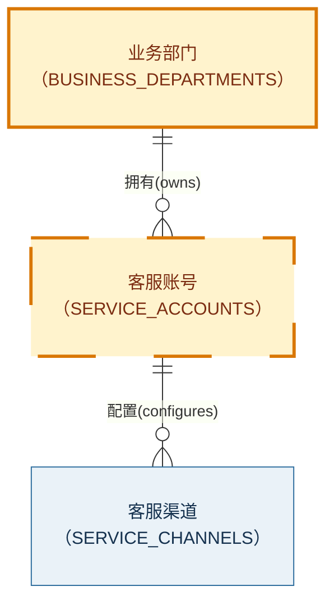
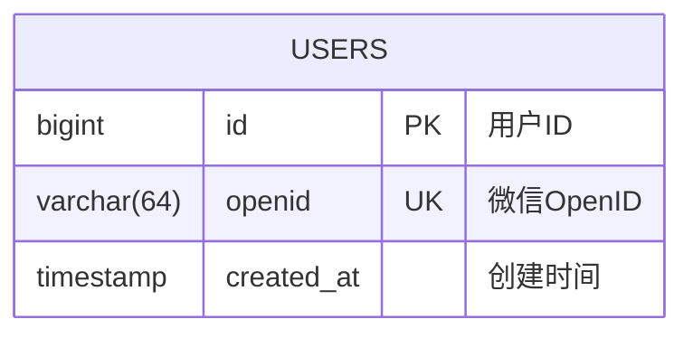
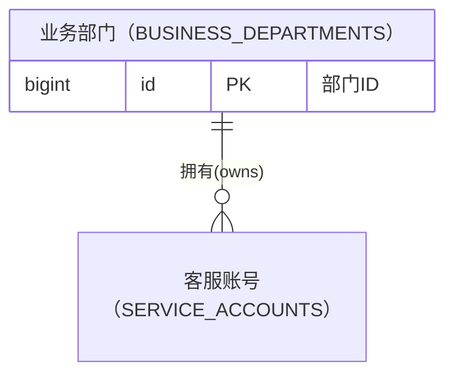
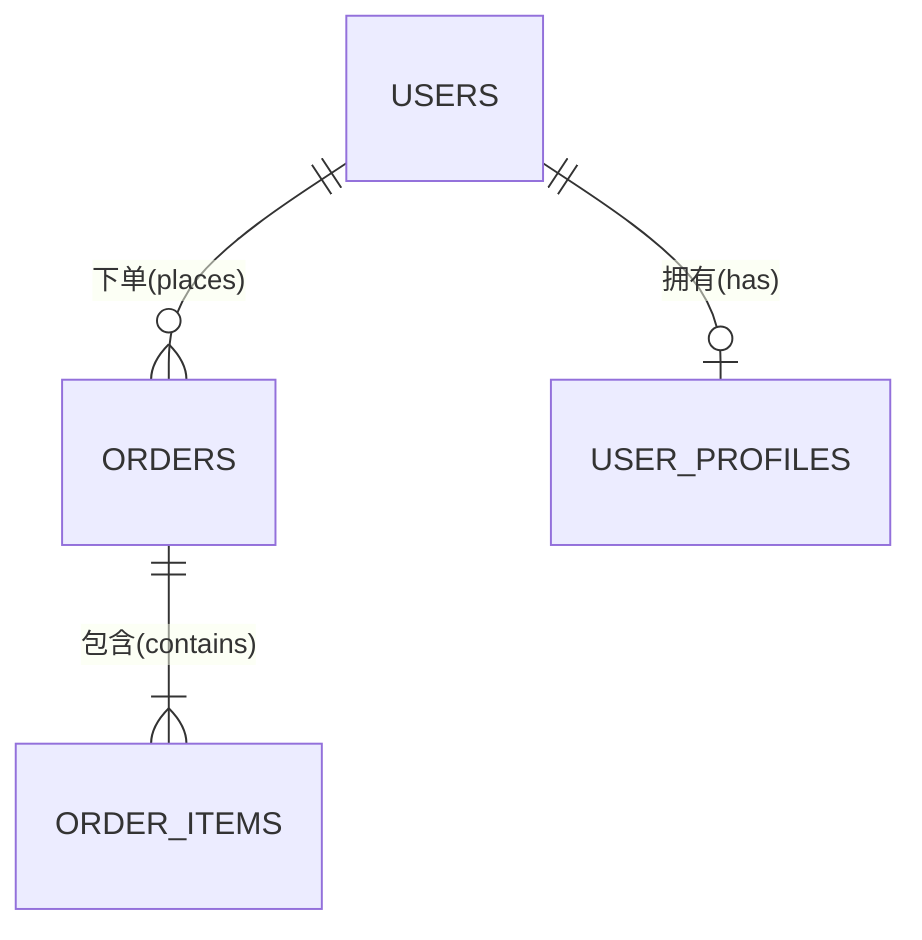

# ER Drawing Rules（ER 图绘制规则）

## Renderer Contract（渲染器契约）

Skill 名称与建模语义不绑定具体语法。当前默认 renderer 是 Mermaid `erDiagram`；用户或调用方明确选择其他 renderer 时，必须先具备对应的语法与验证规则，不得把 Mermaid 指令直接移植到其他语法。

## Modeling Levels（建模层级）

| Level | 适用场景 | 包含内容 | 排除内容 |
|---|---|---|---|
| Conceptual | PRD、领域沟通、范围澄清 | 核心业务对象、关系、主要基数 | SQL 类型、索引、存储引擎细节 |
| Logical | Architecture、跨团队接口设计 | 实体、属性、标识、规范化关系、关联实体 | 未确认的数据库专属实现 |
| Physical | Technical Solution、schema 设计 | 表、列、方言化类型、PK/FK/UK、索引与约束建议 | 无证据的容量和性能结论 |

未指定时，根据输入证据选择最低但足够的层级，并在输出开头声明。若用户明确要求数据库表结构但未提供数据库方言，先询问方言；若无需方言特性，可在用户同意后采用 generic SQL types。

## Field Sufficiency Gate（字段充分性门）

生成任何字段前，先把候选字段分为三层：

| Level | 定义 | 是否进入图中 |
|---|---|---|
| `Explicit` | 用户、权威文档或已授权检查的现有 schema/code 明确给出 | 可以 |
| `Structurally Implied` | 在已确认 relational physical 模型中由明确关系必然导出的字段，例如 1:N 的 N 端 FK | 仅作为 `Candidate` 明示后可以 |
| `Conventional Guess` | 仅因常见实践想到的 `id`、`name`、`status`、`created_at`、`updated_at`、软删除、租户键等 | 不可以自动加入 |

按以下规则选择输出：

1. 输入只描述业务对象与关系、没有明细字段：生成 conceptual ER，只画对象和基数，不创建空想字段。
2. 输入给出少量字段：生成 minimum logical ER，只保留 `Explicit` 字段；结构性候选单独列在图前，未确认时不伪装成事实。
3. 用户要求 physical ER，但字段、数据库方言或关键约束不足：HALT，询问缺失信息；不得用“标准表结构”泛化补齐。
4. 用户允许基于明确关系做候选设计时，可以加入 `Structurally Implied` 字段，但必须在 `Candidate Fields` 中逐项说明推理链。
5. 不因示例、行业惯例或类似项目存在某字段，就把它写入当前模型。

## Evidence Rules（证据规则）

建模前建立三类信息：

- `Confirmed`：输入材料明确陈述，或既有 schema/code 可直接验证。
- `Candidate`：为形成模型提出的候选设计，必须在说明中显式标注。
- `Unresolved`：会改变实体边界、字段、关系基数、optional/mandatory 或生命周期的未决问题。

以下情况不得静默推断：租户隔离策略、软删除、金额精度、时间时区、枚举值、支付与订单基数、用户身份键、级联删除、审计字段、分库分表和敏感数据存储。

## Change Classification（变更对象分类）

对象分类仅针对本次用户描述或指定变更范围：

| Class | 识别证据 | 规则 |
|---|---|---|
| `existing` | “现有”“原有”“已有”“沿用”“保持不变”，或已授权检查的 schema/code 证明对象存在且本次不变 | 对象及本次展示的关系/字段均无调整 |
| `new` | “新增”“新建”“引入”“增加一个对象/表/实体” | 本次创建整个对象 |
| `modified` | “调整”“扩展”“改造”，或明确要求给既有对象增加/删除/修改字段或关系 | 只要对象在本次有字段或关系变化，就优先于 `existing` |
| `unresolved` | 没有足够证据判断变更身份，或不同来源冲突 | 不猜测；提问或以灰色待确认显示 |

证据优先级为：用户本轮明确陈述 > 用户指定的 current change artifact > 已授权检查的现有 schema/code > 早期材料。名称、领域常识和“看起来像旧表”不能作为分类证据。

例如，“业务部门、业务组织是在现有业务对象上新增的”意味着这两个对象是 `new`；若同时要求既有客服账号新增 `organization_id` 或新增归属关系，则客服账号是 `modified`，而不是 `existing`。其余对象只有在用户明确说是原有对象或 schema/code 可验证时，才能标为 `existing`。

## Visual Semantics（视觉语义）

固定使用以下颜色，不得按会话随机更换：

| Class | Meaning | Mermaid style |
|---|---|---|
| `existing` | 既有且本次未调整 | `fill:#EAF2F8,stroke:#2E6E9E,color:#16324F,stroke-width:1px` |
| `new` | 本次新增对象 | `fill:#FFF3CD,stroke:#D97706,color:#7C2D12,stroke-width:3px` |
| `modified` | 既有对象在本次有字段或关系调整 | `fill:#FFF3CD,stroke:#D97706,color:#7C2D12,stroke-width:3px,stroke-dasharray:5 3` |
| `unresolved` | 变更身份待确认 | `fill:#F3F4F6,stroke:#6B7280,color:#374151,stroke-width:2px,stroke-dasharray:3 3` |

颜色表达两个主集合：蓝色表示既有且未调整，橙色表示进入本次变更范围。橙色对象中，新增对象使用实线边框，调整对象使用虚线边框；因此不能只看颜色判断 `new` 与 `modified`，必须同时查看图例和对象分类表。

Mermaid 示例：

图前或图后必须有文字图例，不能只依赖颜色传达含义。Mermaid ER 当前只能稳定地按实体 node 着色；若既有对象只有个别字段发生变化，仍将整个对象标为 `modified`，并在 `Change Notes` 中列出具体字段或关系变化。

## Attribute Syntax（属性语法）

实体块格式：

规则：

- 属性顺序为 `type name [key] ["comment"]`。
- key 只使用 Mermaid 支持的 `PK`、`FK`、`UK`；同一字段有多个 key 时使用逗号分隔。
- comment 放在双引号内，不把 `PK`、`FK`、`UK` 混入 comment。
- Mermaid attribute type 必须以字母开头，可包含数字、连字符、下划线、括号和方括号，但不能包含逗号。`varchar(64)` 可直接使用；`decimal(18,2)` 应改用无逗号的展示类型（如 `decimal_18_2`），并在代码块下方映射回真实 SQL 类型。
- 实体与字段名不得包含空格；实体默认大写 `SNAKE_CASE`，字段默认小写 `snake_case`。
- 注释保持短小。状态全集、复杂约束和长业务说明放在图后，不塞入字段 comment。

## Bilingual Entity Names（双语对象名）

可以同时显示中文对象名和稳定英文 identifier。Mermaid 使用 entity alias：

关系、`class` 和其他内部引用必须继续使用 `BUSINESS_DEPARTMENTS` 这类稳定 identifier；中文只进入 display alias。若目标 renderer 版本不支持 alias，则保留英文 identifier，并用紧邻实体的注释或图后对照表展示中文名。

## Cardinality Matrix（基数矩阵）

每一端由“最小数量 + 最大数量”共同表达：

| Token | 含义 |
|---|---|
| `||` | exactly one |
| `o|` 或 `|o` | zero or one，方向取决于其位于关系哪一端 |
| `|{` 或 `}|` | one or more，方向取决于其位于关系哪一端 |
| `o{` 或 `}o` | zero or more，方向取决于其位于关系哪一端 |

常见关系示例：

不要仅凭外键存在就决定业务基数。必须核对：子记录是否可不存在、父引用是否 nullable、历史记录是否允许多次、关系是否随状态变化。

## Relationship Labels（关系标签）

- Mermaid 关系 label 统一使用双引号包裹的 `中文(英文)` 格式。
- 中文部分采用当前业务语境中的短动词或动词短语；英文部分采用语义对应的简短 verb 或 `snake_case` verb phrase。
- 推荐示例：`"包含(contains)"`、`"拥有(owns)"`、`"配置(configures)"`、`"归属(belongs_to)"`、`"分配(assigns)"`。
- 中文与英文必须表达同一关系方向。例如 `A ||--o{ B : "包含(contains)"` 必须从 A 的视角阅读为“A 包含 B”。
- 避免把基数、字段名、长业务规则或双向描述塞入 label；详细语义放在图后的 Design Notes。
- 如果英文术语缺少可靠对应词，将该关系列入 `Unresolved` 并询问，不得仅输出单语标签。

## Relationship Multiplicity（关系多重性说明）

Mermaid 图形代码之后，必须为图中的每一条实体关系生成明确的自然语言说明。不得只写“一对多”“多对多”等关系名称；必须同时表达两端的最小数量和最大数量。

统一格式：

- 用户到订单：`1 : 0..N`，即用户和订单是 `一对多` 关系

  - 一个用户可以没有订单，也可以有多个订单。
  - 一个订单必须属于一个用户，且只能属于一个用户。

常见 Mermaid 基数与文本表达映射：

| Mermaid | Multiplicity | 关系名称 | 双向语义 |
|---|---|---|---|
| `A ||--|| B` | `1 : 1` | 一对一 | 一个 A 必须对应一个 B；一个 B 必须对应一个 A |
| `A ||--o| B` | `1 : 0..1` | 一对零或一 | 一个 A 可以没有 B，也可以有一个 B；一个 B 必须且只能对应一个 A |
| `A ||--o{ B` | `1 : 0..N` | 一对多 | 一个 A 可以没有 B，也可以有多个 B；一个 B 必须且只能对应一个 A |
| `A ||--|{ B` | `1 : 1..N` | 一对多 | 一个 A 必须至少有一个 B，也可以有多个 B；一个 B 必须且只能对应一个 A |
| `A }o--o{ B` | `0..N : 0..N` | 多对多 | 一个 A 可以没有 B，也可以有多个 B；一个 B 也可以没有 A，或对应多个 A |
| `A }|--|{ B` | `1..N : 1..N` | 多对多 | 一个 A 必须至少对应一个 B；一个 B 也必须至少对应一个 A |

生成规则：

- 标题使用实体的中文 display name，例如“用户到订单”，不使用全大写 identifier 代替业务名称。
- multiplicity 必须从 Mermaid 两端 marker 逐字转换，不能仅凭关系 label 或领域常识推断。
- 每条关系固定生成两个子项：第一项描述左侧实体可以对应多少右侧实体；第二项描述右侧实体可以对应多少左侧实体。
- `0..1` 使用“可以没有，也可以有一个”；`1` 使用“必须且只能有一个”；`0..N` 使用“可以没有，也可以有多个”；`1..N` 使用“必须至少有一个，也可以有多个”。
- 若输入没有确认最小数量，不得擅自选择 `0..N` 或 `1..N`。应把 optionality 列为 `Unresolved`，待确认后再同时更新 Mermaid marker 和自然语言说明。
- 图与文字必须一一对应：不得漏掉关系、增加图中不存在的关系，或让文字基数与 Mermaid marker 冲突。

## Domain and Layout Rules（领域与布局规则）

- 使用 `%% === Domain Name ===` 将实体定义按业务域分组。
- 先定义主实体，再定义从属实体与关联实体；所有关系集中放在实体定义之后。
- 关系标签使用简短的 `中文(英文)`，例如 `"下单(places)"`、`"包含(contains)"`、`"归属(belongs_to)"`、`"引用(references)"`。
- Mermaid ER 自动布局不保证绝对位置。“主表在左/上”只能作为定义顺序提示，不得声称可以完全控制布局或避免所有重叠。
- 图过大时按 bounded context 或业务域拆成多张图，并提供一张只保留跨域实体与关系的 overview。

## Modeling Rules（建模规则）

- 每个 physical entity 必须有稳定标识。若使用自然键，说明其稳定性与变更策略。
- 每条 FK 关系应能在两端实体中找到对应语义；图中的关系与字段约束不得互相矛盾。
- physical 模型不得保留裸 M:N；创建关联实体，并评估是否需要关系属性、有效期或顺序字段。
- 树结构、自引用、弱实体、共享主键一对一、polymorphic association 等模式必须在设计说明中解释。
- 审计字段不是无条件默认值。仅在需求、项目规范或调用方约定要求时加入 `created_at`、`updated_at`、`deleted_at` 等字段。
- 反范式字段必须注明 authoritative source、同步机制与一致性风险。

## Integrity and Index Guidance（完整性与索引指引）

设计说明至少检查：

1. 每个业务唯一性规则是否对应 `UK` 或复合唯一约束建议。
2. 每个 FK 的 nullable、删除/更新策略是否已确认；未确认时列为 open question。
3. FK、唯一查询、常用过滤/排序和关联路径是否需要索引。
4. 复合索引顺序是否来自具体查询模式，而不是泛泛“全部加索引”。
5. 金额、时间、状态、敏感数据和租户键是否有明确约束。

Mermaid ER 图不能完整表达 partial index、check constraint、deferrable constraint、partitioning 或所有复合约束。这些内容应在图后以文字或 DDL appendix 补充。

## Output Template（输出模板）

按以下顺序输出：

1. `Modeling Scope（建模范围）`：列出 `Level`、`Scope`、`Dialect` 和 `Renderer`。
2. `Field Sufficiency（字段充分性）`：说明输入是否足以生成字段、采用了哪一级字段证据。
3. `Change Classification（变更分类）`：逐对象列出 `existing/new/modified/unresolved` 及证据。
4. `Assumptions and Open Questions（假设与未决问题）`：分别列出 `Confirmed`、`Candidate Fields` 和 `Unresolved`。
5. `ER Diagram（ER 图）`：提供选定 renderer 的 fenced code block、固定视觉语义和图例。
6. `Relationship Multiplicity（关系多重性说明）`：逐条输出 `A 到 B`、数值多重性、关系名称及两个方向的自然语言约束。
7. `Change Notes（变更说明）`：列出 `modified` 对象的具体字段或关系变化。
8. `Design Notes（设计说明）`：解释实体边界、生命周期和范式/反范式选择。
9. `Constraints and Indexes（约束与索引）`：列出图中无法完整表达的约束与索引建议。

如果 `Unresolved` 会实质改变模型，应先提问并停止，不输出伪完整图。若只是低风险展示偏好，可以明确假设后继续。

## Validation Checklist（验证清单）

- 代码块首行是 `erDiagram`。
- 每个关系引用的实体都已定义。
- 每个实体名和字段名均无空格。
- 每个 display alias 都保留可供关系与样式引用的稳定英文 identifier。
- 每个字段都能回连 `Explicit` 或已明示的 `Structurally Implied` 证据。
- 每个对象的变更分类都有明确证据；`modified` 优先于 `existing`。
- `existing/new/modified/unresolved` 使用固定颜色，并提供非颜色图例。
- attribute key 与 comment 分离。
- FK 字段、关系方向和基数语义一致。
- 每条 Mermaid 关系 label 都符合双引号包裹的 `中文(英文)` 格式，且两种语言的关系方向一致。
- 图中每条关系在图后恰好有一项多重性说明，并且两个方向的自然语言与 Mermaid marker 一致。
- physical M:N 已转换为关联实体。
- 所有推断均已标记为 `Candidate`，关键缺口均已列为 `Unresolved`。
- 未把 Mermaid 成功渲染、设计图存在或文档状态写成数据库已实现/已验证证据。

## Source Basis（规范来源）

- Mermaid 官方 Entity Relationship Diagram 语法：<https://mermaid.ai/open-source/syntax/entityRelationshipDiagram.html>（核验日期：2026-09-03）。
- `direction`、nullable type、subgraph 等能力可能受 Mermaid renderer 版本影响；除非调用环境版本已确认，否则核心输出只依赖基础 `erDiagram`、attribute、key/comment 和 Crow's Foot 关系语法。
