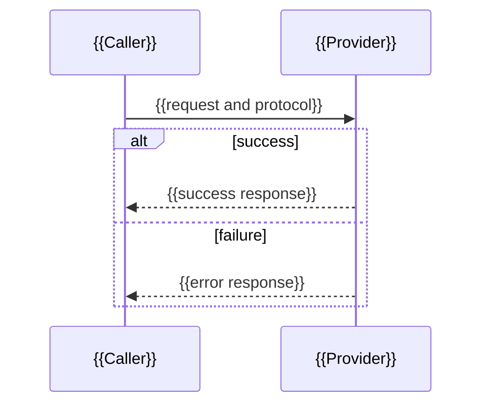

# Technical Solution Document Template（技术方案说明文档模板）

复制下方 `markdown` code block 内的内容创建输出文档，并移除最外层 code fence。所有 `{{...}}` 必须替换；条件章节不适用时，在 Applicability Matrix 中记录 `N/A` 与理由后可省略正文。

````markdown
---
title: "{{project-or-requirement-title}}技术方案说明文档"
requirementId: "{{requirement-id}}"
status: "Draft"
version: "1.0.0"
authors:
  - "{{author}}"
reviewers:
  - "{{reviewer-or-tbd}}"
updatedAt: "{{yyyy-mm-dd}}"
targetRelease: "{{release-or-tbd}}"
generatedBy: "speclite-create-technical-solution-document"
sourceDocuments:
  - path: "{{source-path}}"
    type: "{{source-type}}"
    version: "{{version-or-commit}}"
    status: "Confirmed"
---

# {{project-or-requirement-title}}技术方案说明文档

## Document Control（文档控制）

| 字段 | 内容 |
|---|---|
| Requirement ID | `{{requirement-id}}` |
| Status | `Draft` |
| Version | `1.0.0` |
| Authors | {{authors}} |
| Reviewers | {{reviewers}} |
| Target Release | {{target-release}} |
| Updated At | {{yyyy-mm-dd}} |

### Source Baseline（来源基线）

| Source | Type | Version / Commit | Status | Used For |
|---|---|---|---|---|
| {{source}} | {{type}} | {{version}} | `Confirmed` | {{purpose}} |

### Applicability Matrix（适用性矩阵）

| Section | Status | Reason / Owner / Due Date |
|---|---|---|
| Terminology and Domain Model | {{Applicable-or-NA}} | {{reason}} |
| Integration Contracts | {{Applicable-or-NA}} | {{reason}} |
| Data Design | {{Applicable-or-NA}} | {{reason}} |
| UI and Interaction | {{Applicable-or-NA}} | {{reason}} |
| Work Estimate | {{Applicable-or-NA}} | {{reason}} |

## Executive Summary（执行摘要）

### Problem（问题）

{{用一段话描述需要解决的问题。}}

### Goals and Non-goals（目标与非目标）

- Goal：{{目标}}
- Non-goal：{{明确不解决的内容}}

### Solution at a Glance（方案摘要）

{{用一至三段说明核心方案、主要影响、关键取舍和 readiness。}}

### Key Risks（关键风险）

| Risk | Impact | Mitigation | Owner | Status |
|---|---|---|---|---|
| {{risk}} | {{impact}} | {{mitigation}} | {{owner}} | {{status}} |

## Context and Scope（背景与范围）

### Background（背景）

{{业务和技术背景。}}

### In Scope（范围内）

- {{范围项}}

### Out of Scope（范围外）

- {{范围外项}}

### Constraints and Assumptions（约束与假设）

| Item | Type | Evidence Status | Impact |
|---|---|---|---|
| {{item}} | Constraint / Assumption | Confirmed / Proposed / TBD | {{impact}} |

## Current and Target State（现状与目标态）

### Current State（现状）

{{只写有证据支撑的当前事实。}}

### Target State（目标态）

{{说明目标设计，并标识 Proposed / Approved。}}

### Change Delta（变更清单）

| Area | Current | Target | Change Type | Evidence Status |
|---|---|---|---|---|
| {{area}} | {{current}} | {{target}} | Changed / Unchanged / Removed | Confirmed / Proposed |

## Terminology and Domain Model（术语与领域模型）

| Term | 中文说明 | Definition | Source |
|---|---|---|---|
| {{term}} | {{中文说明}} | {{definition}} | {{source}} |

<!-- 存在复杂领域关系或状态时加入 classDiagram / stateDiagram-v2。 -->

## Architecture Overview（架构总览）

### System Responsibilities（系统职责）

| System / Component | Owner | Responsibility | Change | Data Responsibility | Operational Owner |
|---|---|---|---|---|---|
| {{system}} | {{owner}} | {{responsibility}} | Changed / Unchanged / External | {{data-role}} | {{ops-owner}} |

### Architecture Diagram（架构图）

图示目的：{{说明图要回答的问题。}}

```mermaid
flowchart LR
    A[{{System A}}] -->|{{protocol or event}}| B[{{System B}}]
```

关键结论：{{解释边界、方向、变化和读者应关注的内容。}}

### Decisions and Alternatives（决策与替代方案）

| Decision | Selected Option | Alternatives | Trade-off | Status | Owner |
|---|---|---|---|---|---|
| {{decision}} | {{option}} | {{alternatives}} | {{trade-off}} | Proposed / Approved | {{owner}} |

## Detailed Design（详细设计）

### {{Scenario Name}}（{{场景中文名}}）

#### Preconditions（前置条件）

- {{precondition}}

#### Main Flow（主流程）

1. {{step}}

#### Failure and Recovery（失败与恢复）

| Failure | Detection | Immediate Behavior | Retry / Compensation | User Impact | Owner | Verification |
|---|---|---|---|---|---|---|
| {{failure}} | {{detection}} | {{behavior}} | {{recovery}} | {{impact}} | {{owner}} | {{verification}} |

#### Sequence（交互时序）

图示目的：{{说明本时序图的范围。}}



关键结论：{{解释同步/异步、失败、超时、重试和幂等。}}

## Integration Contracts（集成契约）

| Interaction | Direction | Transport / Mode | Authority / Version | Auth | Timeout / Retry | Idempotency | Compatibility | Owner |
|---|---|---|---|---|---|---|---|---|
| {{interaction}} | {{direction}} | {{transport}} | {{contract-link}} | {{auth}} | {{policy}} | {{key-or-na}} | {{strategy}} | {{owner}} |

### Contract Delta（契约变化）

| Contract | Change | Validation | Error Semantics | Rollout Order |
|---|---|---|---|---|
| {{contract}} | {{delta}} | {{validation}} | {{errors}} | {{order}} |

## Data Design（数据设计）

### Data Ownership（数据所有权）

| Data | System of Record | Producer | Consumer | Classification | Retention |
|---|---|---|---|---|---|
| {{data}} | {{sor}} | {{producer}} | {{consumer}} | {{classification}} | {{retention}} |

### Schema and Migration（Schema 与迁移）

| Entity / Table | Change | Index / Constraint | Migration | Compatibility | Rollback |
|---|---|---|---|---|---|
| {{entity}} | {{change}} | {{index}} | {{migration}} | {{compatibility}} | {{rollback}} |

<!-- 需要时加入 erDiagram；完整 DDL 链接到 migration owner。 -->

## Quality Attributes（质量属性）

| Attribute | Target / Constraint | Design | Evidence / Verification | Status |
|---|---|---|---|---|
| Performance / Capacity | {{target}} | {{design}} | {{verification}} | Confirmed / Proposed / TBD / N/A |
| Reliability / Consistency | {{target}} | {{design}} | {{verification}} | {{status}} |
| Security / Privacy | {{target}} | {{design}} | {{verification}} | {{status}} |
| Observability | {{target}} | {{design}} | {{verification}} | {{status}} |
| Degradation / Recovery | {{target}} | {{design}} | {{verification}} | {{status}} |

## Deployment and Migration（部署与迁移）

### Release Plan（发布计划）

| Stage | Change | Entry Criteria | Verification | Rollback Trigger | Owner |
|---|---|---|---|---|---|
| {{stage}} | {{change}} | {{criteria}} | {{verification}} | {{trigger}} | {{owner}} |

### Configuration and Feature Flags（配置与 Feature Flag）

| Item | Scope | Default | Secret / Sensitive | Rollout | Rollback |
|---|---|---|---|---|---|
| {{item}} | {{scope}} | {{default}} | Yes / No | {{rollout}} | {{rollback}} |

## Test and Acceptance（测试与验收）

| Test Level | Scenario | Expected Result | Evidence | Owner |
|---|---|---|---|---|
| Unit / Integration / E2E / Performance / Security | {{scenario}} | {{expected}} | {{evidence}} | {{owner}} |

### Acceptance Gate（验收门禁）

- {{可执行、可观察的验收条件。}}

## Risks and Open Questions（风险与开放问题）

### Risks and Dependencies（风险与依赖）

| ID | Risk / Dependency | Probability | Impact | Mitigation | Owner | Status |
|---|---|---|---|---|---|---|
| {{id}} | {{item}} | {{probability}} | {{impact}} | {{mitigation}} | {{owner}} | {{status}} |

### Open Questions（开放问题）

| ID | Question | Owner | Due Date | Blocking Impact | Close Condition |
|---|---|---|---|---|---|
| {{id}} | {{question}} | {{owner}} | {{yyyy-mm-dd}} | {{impact}} | {{condition}} |

### Conflict Register（冲突登记）

| Conflict ID | Sources | Contradiction | Impact | Owning Workflow | Status |
|---|---|---|---|---|---|
| {{id}} | {{sources}} | {{contradiction}} | {{impact}} | {{workflow}} | {{status}} |

## Traceability and Appendices（追溯与附录）

### Requirement Traceability（需求追溯）

| Requirement ID | Design Section | Component or Contract | Verification | Status |
|---|---|---|---|---|
| {{requirement-id}} | {{section}} | {{component-or-contract}} | {{verification}} | Covered / Partial / Blocked |

### Decision Log（决策记录）

| Decision ID | Decision | Rationale | Owner | Status | Date |
|---|---|---|---|---|---|
| {{id}} | {{decision}} | {{rationale}} | {{owner}} | Proposed / Approved | {{yyyy-mm-dd}} |

### Authoritative References（权威参考）

- {{PRD / Architecture / Story / OpenAPI / AsyncAPI / migration / dashboard link}}

---

*本文档由 speclite-create-technical-solution-document Skill 自动生成*
````
