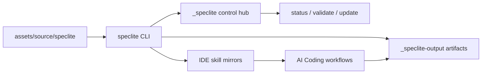

# Local-First Control Plane（本地优先控制面）

SpecLite 是 local-first CLI control plane：它不把团队的 AI Coding workflow 托管到远端服务，而是把 canonical methodology package 安装到目标项目的本地文件系统中，并通过 CLI 命令维护、验证和解释这套本地运行状态。

## Overview（概览）

Control plane 的职责不是替你完成每一次研发任务，而是让本地项目拥有可发现、可配置、可验证、可更新、可审查的 AI Coding 方法论入口。



这个模型保留两条输出路径：

| Output path | Audience | Contract |
|---|---|---|
| Human-readable output | 终端用户、维护者、agent 操作者 | outcome-oriented frame，帮助人理解结果和下一步。 |
| `CommandResult` JSON | CI、脚本、工具和 installed skills | stable schema、stable fields、stable exit behavior。 |

## Why Local First（为什么本地优先）

SpecLite 的核心产物是本地项目中的方法论执行系统。local-first 设计带来几个直接收益：

- 团队可以在自己的仓库里审查 runtime、skill mirrors、manifest/index 和 workflow artifacts。
- `status`、`validate`、`update` 和 `repair` 可以基于本地 evidence 工作，不依赖 hosted service。
- 安装、更新和卸载都能遵守 file ownership model，避免静默覆盖 human-owned custom files 或 workflow-owned artifacts。
- CI 可以读取 `--json`，而人可以读取 human-readable output，两者互不污染。

## Control Plane Commands（控制面命令）

| Command | Control-plane role | Writes by default |
|---|---|---|
| `install` | 建立 runtime、IDE mirrors、manifest/index 和 artifact root。 | 否；需要 `--yes`。 |
| `status` | 给出 lightweight installed-state summary。 | 否。 |
| `validate` | 执行本地 deterministic validation。 | 否。 |
| `update` | 生成或执行 source-to-runtime update plan。 | 否；需要 `--yes`。 |
| `update --repair` | 显式修复可安全恢复的 installer-owned drift。 | 否；需要 `--yes`。 |
| `init`、`sync`、`uninstall` | 管理 config、source projections 和 installer-owned files。 | 否；写入/移除需要 `--yes`。 |
| `doctor`、`governance-report` | 生成 richer diagnostics 或流程治理 evidence。 | 否。 |

`resolve config` 和 `resolve customization` 属于 runtime support API surface，主要给 installed skills 和维护者排查使用。默认 `resolve` stdout 保持 pure JSON；只有显式 `--human` 时才渲染 support frame。

## Human Output Layer（人类输出层）

当前 CLI 的常用 human-readable output 使用 outcome-oriented frame。它的目标是让人快速回答三个问题：

1. 当前命令结果是什么？
2. 有没有写入项目文件？
3. 下一步应该做什么？

典型结构：

```text
SpecLite status
Outcome: installed

Summary
Completed: yes
Writes: no project files changed
User action: not required

Issues:
No issues

Next Actions / Next actions:
- No action required.
```

默认 locale 是 `zh-CN`。中文输出会本地化自然语言、section label、empty state 和 next action prose，但保留英文技术标识，例如 command name、flag、path、schema id、issue id、category、severity、reason code。

## Machine Contract Layer（机器契约层）

`--json` 输出用于自动化。它不应被 human renderer 影响：

| Human renderer variable | JSON effect |
|---|---|
| `--locale` / `SPECLITE_LOCALE` | 不改变 JSON field、status、issue order 或 path normalization。 |
| `NO_COLOR` | 不改变 JSON。 |
| TTY / non-TTY / CI | 不改变 JSON。 |
| terminal width | 不改变 JSON。 |
| spinner、heading、empty-state prose | 不进入 JSON contract。 |

自动化应读取 `schemaVersion`、`command`、`status`、`issues[]` 和 command-specific `data`。不要解析 human-readable output，也不要把 `summary` 或 `nextActions` 当作状态机。

## Boundary With Execution Plane（与执行面的边界）

SpecLite control plane 管理方法论入口和本地 evidence，但不替代 AI IDE 的执行面。

| Layer | Examples | Responsibility |
|---|---|---|
| Canonical package source | `assets/source/speclite/` | 定义可安装的方法论内容。 |
| Control hub | `_speclite/` | 存放 config、manifest/index、source descriptor 和 lock。 |
| Execution plane | `.claude/skills/`、`.agents/skills/` | 让 IDE 或 agent runtime 发现并执行 skills。 |
| Artifact repository | `_speclite-output/` | 保存 planning、implementation、review 和 governance 过程产物。 |

Control plane 可以验证 mirrors 和 manifest 是否一致，但不评价人工 review 是否充分，也不证明团队真实执行质量。

## Design Rules（设计规则）

- Read before write：先用 `status` / `validate` 理解状态，再用 `install` / `update` / `repair` 写入。
- Explicit authorization：写入或移除必须显式 `--yes`。
- Local deterministic validation：`validate` 不访问远程 source；远程 freshness/provenance revalidation 必须显式进入 `doctor --revalidate-source --yes` 或对应 source resolution flow。
- Human and machine separation：人读 outcome frame，机器读 `CommandResult` JSON。
- Ownership protection：human-owned 和 workflow-owned paths 不被静默覆盖。

## Related Documents（相关文档）

| Topic | Document |
|---|---|
| 首次安装教程 | [`../tutorials/quick-start.md`](../tutorials/quick-start.md) |
| CLI 参数和输出模式 | [`../reference/cli.md`](../reference/cli.md) |
| Human output 覆盖矩阵 | [`../reference/cli-human-output-matrix.md`](../reference/cli-human-output-matrix.md) |
| JSON contract | [`../reference/command-result-json.md`](../reference/command-result-json.md) |
| Runtime/file boundary | [`runtime-boundaries.md`](runtime-boundaries.md) |
