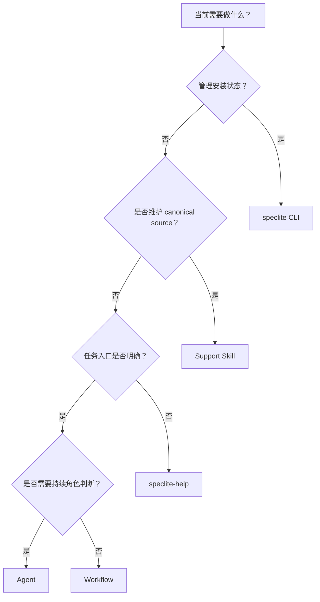
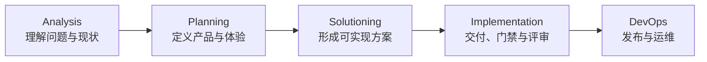

# Skill Taxonomy And SDLC（Skill 分类与 SDLC）

SpecLite 把能力组织成可安装的 Skill packages，但不同 Skill 承担的职责并不相同。本文从使用者视角解释 CLI、Agent、Workflow 与 support Skill 的边界，并说明如何根据任务所在的 SDLC 阶段选择入口。

## Mental Model（心智模型）

使用 SpecLite 时，先区分“安装管理”和“研发执行”：



`speclite CLI` 不属于 installed Skill 分类。它是 control plane，用来安装和维护 runtime。Agent、Workflow 和 `speclite-help` 都是 AI IDE 可发现的 Skill；support Skill 则是维护 SpecLite canonical source 的工具，默认不会安装到普通目标项目。

## Taxonomy By Responsibility（按职责分类）

| 入口 | 核心问题 | 当前载体 | 典型结果 |
|---|---|---|---|
| CLI | 本地 SpecLite 是否已安装、健康、需要更新或修复？ | `speclite <command>` | runtime、manifest/index、diagnostics 或 update plan。 |
| Agent | 谁应以某个研发角色持续协作、判断并分发任务？ | `speclite-agent-*` role activation Skill | 角色化建议、菜单路由和 Workflow 分发。 |
| Workflow | 应按什么步骤完成一个边界明确的任务？ | 带执行流程、输入、产物和验证的 Skill package | PRD、Architecture、Story、review、实现或报告。 |
| Support Skill | 如何创建、检查或治理 SpecLite 自身的 canonical Skill source？ | `assets/source/speclite/support-skills/` | creator、lint 或 canonical source consistency report。 |

Skill 是 package 与加载单位，不等同于 Workflow。当前主要关系是：

- `core-skills/` 提供 required baseline 中的共享帮助、协作、文档和 review 能力。
- `sdlc-skills/` 提供 default-selected SDLC Agent 与 Workflow。
- `ecosystems/<category>/<id>/` 提供 selected-only extension Skill，只有显式选择相应 module 后才进入目标项目。
- `support-skills/` 服务 canonical source 维护，不属于默认安装 module。

## Entry Decision Table（入口决策表）

| 当前场景 | 推荐入口 | 原因 | 示例 |
|---|---|---|---|
| 安装、查看状态、校验、更新或修复 SpecLite | CLI | 这是 local runtime lifecycle，不是研发 Workflow。 | `speclite status "$PROJECT_ROOT"`、`speclite validate "$PROJECT_ROOT"`。 |
| 已安装，但不知道当前阶段或下一项 Skill | `speclite-help` | 它读取 help catalog、runtime config、已有产物和项目知识后给出有证据的路由。 | “检查当前产物并推荐下一步 Skill。” |
| 问题仍模糊，需要某个角色持续追问、判断和分发 | Agent | Agent 保持 persona，并通过菜单把明确任务交给 Workflow。 | 激活 PM 澄清产品需求；激活 Architect 判断方案取舍。 |
| 目标、输入和期望产物已经明确 | Workflow | 直接执行可以减少不必要的角色层，保持流程和完成标准清晰。 | 调用 `speclite-create-prd` 或 `speclite-dev-story`。 |
| 只需查询命令、字段、目录或 Skill catalog | Reference 文档 | 不需要启动角色或执行流程。 | 阅读 `reference/cli.md` 或 `reference/skills/sdlc-workflows.md`。 |
| 创建或检查 canonical Skill / Agent package | Support Skill | 这是 SpecLite 维护活动，不是普通目标项目的 SDLC 任务。 | `speclite-skill-creator`、`speclite-agent-lint`。 |

一个简单判断原则是：**状态问题交给 CLI，方向问题先用 Help，角色问题交给 Agent，明确任务交给 Workflow，canonical source 维护交给 support Skill。**

## CLI Boundary（CLI 边界）

CLI 管理 canonical source 到 installed runtime projection 的生命周期：

| 任务 | 推荐命令 |
|---|---|
| 目标项目 preflight | `speclite install "$PROJECT_ROOT"` |
| 授权默认安装 | `speclite install "$PROJECT_ROOT" --yes` |
| 轻量 installed-state summary | `speclite status "$PROJECT_ROOT"` |
| 完整本地校验 | `speclite validate "$PROJECT_ROOT"` |
| 查看可用和已安装能力 | `speclite list "$PROJECT_ROOT"` |
| 预览 source-to-runtime update | `speclite update "$PROJECT_ROOT"` |
| 授权 non-conflicting update | `speclite update "$PROJECT_ROOT" --yes` |

CLI 可以投影和验证 Skill mirrors，但不执行 PRD、Architecture、Story 或 Code Review。后者由 AI IDE 中的 installed Workflow Skill 完成。

## Agent Boundary（Agent 边界）

Agent 是 role activation Skill，适合以下情况：

- 你需要 Business Analyst、PM、Architect、Developer 或 Technical Writer 等角色先帮助判断问题。
- 任务需要多轮澄清，并且应持续保持同一种角色口径。
- 你知道大致职责，但不确定应该分发到哪个 Workflow。

Agent 不应该复制 Workflow 的完整执行步骤。角色完成判断后，应把明确任务分发给对应 Workflow。反过来，如果用户已经明确要求“创建 Architecture”或“实现这份 Story”，通常可以直接调用 Workflow，无须先激活 Agent。

Agent roster 和激活模型见 [`speclite-agents.md`](speclite-agents.md)。

## Workflow Boundary（Workflow 边界）

Workflow 是用于完成具体任务的 Skill。一个可执行 Workflow 通常会说明：

| 要素 | 回答的问题 |
|---|---|
| Trigger | 何时应该使用？ |
| Inputs | 需要哪些文档、代码、配置或用户授权？ |
| Steps | 应按什么顺序分析、生成、修改或检查？ |
| Outputs | 产物写到哪里，谁继续消费？ |
| Boundaries | 哪些事实不能猜测，哪些写入必须先确认？ |
| Verification | 怎样证明任务已经完成？ |

Workflow 适合可重复、多步骤、需要产物或验证的任务。单纯查询实现事实时，应直接读取代码与文档；不要为了回答一个问题启动不必要的 Workflow。

Workflow package 与执行边界见 [`speclite-workflows.md`](speclite-workflows.md)。

## Support Skill Boundary（Support Skill 边界）

Support Skill 用于维护 `assets/source/speclite/` 中的 canonical Skill source，例如：

| Support Skill | 维护职责 |
|---|---|
| `speclite-skill-creator` | 创建或迁移普通 Workflow Skill package。 |
| `speclite-skill-lint` | 检查普通 Skill 的 metadata、内容约束和 workflow density。 |
| `speclite-agent-creator` | 创建或迁移 role activation Agent package。 |
| `speclite-agent-lint` | 检查 Agent persona、菜单和持续身份语义。 |
| `speclite-canonical-source-governance-runner` | 对 canonical source 变更分类并组织派生同步。 |
| `speclite-check-canonical-source-change` | 检查 package counts、catalog、fixtures、docs 和 packaging 等派生一致性。 |

普通项目开发者不应把 support Skill 当成 SDLC 必经 gate。它们不属于默认 `core` + `sdlc` install set；只有在维护 SpecLite 自身的方法论 source 时才进入任务范围。

完整 catalog 见 [`../reference/skills/support-skills.md`](../reference/skills/support-skills.md)。

## SDLC Overview（SDLC 概览）

SpecLite SDLC Module 按生命周期组织 Agent 和 Workflow：



每个阶段回答的问题、职责、典型 Workflow 与典型产物见 [`../reference/sdlc-phases.md`](../reference/sdlc-phases.md)；选择入口时先判断当前任务处在哪个问题上，再进入对应阶段的 Skill catalog。

阶段是一种发现和排序方式，不是要求每个任务都从 Analysis 开始。Brownfield 项目可以先建立 baseline 再进入 Planning；已有明确 Story 的任务可以从 Implementation 开始；小型明确变更可以使用 Quick Dev，并按实际风险增加 review 或 checkpoint。

## Common Routes（常见路径）

### Brownfield Feature（既有项目功能）

```text
brownfield baseline → PRD → Architecture → Epics/Stories
→ implementation readiness → Story/Flow Gate → Dev Story → Code Review
```

这条路径适合缺少可信项目上下文、且变更会影响多个模块的既有系统。

### Focused Change（明确的小型变更）

```text
speclite-help（可选） → Quick Dev → checkpoint/review（按风险选择）
```

当需求、范围和验收标准已经明确时，无须为了形式完整而生成所有规划产物。

### Role-Led Discovery（角色主导的发现）

```text
Agent → 澄清事实与目标 → 分发到具体 Workflow → 检查 Artifact
```

这条路径适合用户知道需要哪类专业判断，但暂时无法选择具体 Workflow。

## Selection Rules（选择规则）

- 先用 `status` / `validate` 确认 runtime，再讨论 installed Skill 执行问题。
- 不确定下一步时，让 `speclite-help` 读取当前项目 evidence，而不是凭记忆选择 Skill。
- 有清晰目标时直接调用 Workflow，不强制先激活 Agent。
- 根据真实任务选择 SDLC 起点，不机械执行完整链路。
- ecosystem Skill 只有相应 module 已显式安装时才可视为 runtime 能力。
- support Skill 只服务 canonical source 维护，不把它写进普通开发者的必经流程。
- Workflow 完成后检查真实 Artifact、验证结果和 next action，不只依赖对话摘要。

## Evidence Anchors（事实锚点）

| 事实 | 来源 |
|---|---|
| `core` required、`sdlc` default-selected 与配置字段 | `assets/source/speclite/core-skills/module.yaml`、`assets/source/speclite/sdlc-skills/module.yaml` |
| Agent roster 与阶段 | `assets/source/speclite/sdlc-skills/module.yaml` |
| Workflow menu、阶段、前后置与输出位置 | `assets/source/speclite/sdlc-skills/module-help.csv` |
| Skill package roots 与 source taxonomy | `assets/source/speclite/README.md` |
| Support Skill 非默认安装边界 | `assets/source/speclite/support-skills/`、`docs/reference/skills/support-skills.md` |
| CLI command surface | `src/bin/speclite.ts`、`src/commands/resolve.ts`、`docs/reference/cli.md` |

## Related Documents（相关文档）

| Relationship | Document |
|---|---|
| 前置：初学者全景导览 | [`../tutorials/speclite-orientation.md`](../tutorials/speclite-orientation.md) |
| 下一步：调用 installed Skill | [`../how-to/use-installed-skills.md`](../how-to/use-installed-skills.md) |
| 概念：Module 组织边界 | [`speclite-modules.md`](speclite-modules.md) |
| 概念：Agent 激活与分发 | [`speclite-agents.md`](speclite-agents.md) |
| 概念：Workflow package 与执行边界 | [`speclite-workflows.md`](speclite-workflows.md) |
| 参考：SDLC Workflow catalog | [`../reference/skills/sdlc-workflows.md`](../reference/skills/sdlc-workflows.md) |
| 参考：Support Skill catalog | [`../reference/skills/support-skills.md`](../reference/skills/support-skills.md) |
| 参考：Workflow artifact layout | [`../reference/workflow-artifact-layout.md`](../reference/workflow-artifact-layout.md) |
