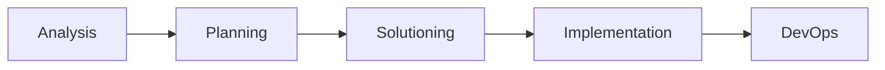

# SpecLite Workflows（SpecLite Workflow 简介）

SpecLite Workflow 是把复杂研发任务拆成可执行规约、步骤、检查清单、模板和产物约定的 Skill。它通过渐进式披露和顺序执行，让 AI 不再依赖一次性大提示词，而是按可审查的流程推进工作。

在当前 SpecLite 体系中，Workflow 通常表现为一个 canonical Skill package：入口是 `SKILL.md`，细节放在 `references/`，模板放在 `assets/`，必要的本地脚本放在 `scripts/`。

## Overview（概览）

Workflow 解决的问题是“如何可靠地完成一个复杂任务”。它可以是分析、调研、PRD、UX、架构、Story、Review、实现、QA、发布或文档治理流程。

与旧式单个 prompt 不同，SpecLite Workflow 会明确：

| 维度 | Workflow 需要说明什么 |
|---|---|
| 触发条件 | 什么时候使用这个 Skill。 |
| 输入 | 需要哪些文档、代码、上下文或用户授权。 |
| 步骤 | 按什么顺序审计、生成、验证或修改。 |
| 产物 | 输出到哪个 runtime 路径，产物类型是什么。 |
| 边界 | 哪些内容不能猜测，哪些内容必须先询问。 |
| 验证 | 用哪些检查或测试确认结果。 |

## Workflow Package（Workflow 包结构）

当前 canonical Workflow Skill 通常使用以下结构：

| 路径 | 作用 |
|---|---|
| `SKILL.md` | 入口规则、触发描述、核心能力和执行流程。 |
| `SKILL.en.md` | 可选英文镜像。 |
| `CHANGELOG.md` | 版本和变更记录。 |
| `customize.toml` | 默认 workflow 或 agent 配置。 |
| `references/` | 详细流程、协议、检查清单和子步骤。 |
| `assets/` | 模板、骨架文件和可复用输出格式。 |
| `data/` | 结构化查表数据。 |
| `scripts/` | Skill 本地可执行脚本。 |

并不是每个 Workflow 都必须拥有所有目录。简单 Workflow 可以只用 `SKILL.md`；复杂 Workflow 会把规则拆进 `references/`，把可填模板放进 `assets/`。

## Progressive Disclosure（渐进式披露）

SpecLite Workflow 的核心价值是渐进式披露：入口只提供足够启动和路由的信息，细节按需要加载。

这种做法带来三个结果：

| 结果 | 说明 |
|---|---|
| 专注 | AI 每次只处理当前阶段所需事实和规则。 |
| 可审查 | 步骤、输入、输出和验证能被单独检查。 |
| 可维护 | 规则变更可以落在 `references/` 或 `assets/`，不必改写整段大提示词。 |

对于 Story Review、Code Review、flow gate 这类质量流程，渐进式披露尤其重要：reviewer、evaluator、fixer、finalizer 各自承担不同职责，避免把发现问题、判断有效性、修复代码和关闭状态混在一个步骤里。

## Current SDLC Flow（当前 SDLC 流程）

`SpecLite SDLC Module` 将 Workflow 按阶段组织：

| 阶段 | 目录 | 典型 Workflow |
|---|---|---|
| Analysis | `1-analysis/` | research、brownfield baseline、Product Brief、PRFAQ、docs writing。 |
| Planning | `2-plan-workflows/` | PRD create / validate / edit、UX design。 |
| Solutioning | `3-solutioning/` | Architecture、Epics and Stories、Story Review、implementation readiness。 |
| Implementation | `4-implementation/` | Sprint Planning、Flow Gate、Create Story、Dev Story、Code Review、QA、Retrospective。 |
| DevOps | `5-devops/` | npm package publish workflow。 |

`module-help.csv` 进一步记录 menu code、前后置关系和输出位置。例如 `CP` 创建 PRD，`CA` 创建 Architecture，`CE` 创建 Epics and Stories，`SP` 启动 Sprint Planning，`CR1` 到 `CR6` 形成 Code Review 链路，`NP` 负责 npm 发布。

## Workflow Chains（工作流链）

SpecLite 的 SDLC Workflow 可以串联运行，前一个产物成为后一个输入：

实际使用时并不要求每个项目都走完整链路。Brownfield 项目可能先运行 `speclite-brownfield-context-builder`，再进入 PRD、Architecture 和 Story；小修复可能直接使用 `speclite-quick-dev`，再用 review 或 checkpoint 收口。

## Workflow Types（Workflow 类型）

| 类型 | 示例 | 主要产物 |
|---|---|---|
| 发现与研究 | `speclite-market-research`、`speclite-domain-research`、`speclite-technical-research` | research documents。 |
| Brownfield 基线 | `speclite-brownfield-context-builder` | evidence、baseline、deep-dives、planning handoff。 |
| 产品与计划 | `speclite-product-brief`、`speclite-prfaq`、`speclite-create-prd` | brief、PRFAQ、PRD。 |
| 方案设计 | `speclite-create-architecture`、`speclite-create-epics-and-stories` | architecture、epics、stories。 |
| 质量检查 | `speclite-story-review-*`、`speclite-flow-gate`、`speclite-code-review-*` | review summary、evaluation、fix summary、gate report。 |
| 实现执行 | `speclite-create-story`、`speclite-dev-story`、`speclite-quick-dev` | story、implementation、tests。 |
| 发布运维 | `speclite-npm-publisher` | npm release report。 |
| 文档治理 | `speclite-write-opensource-docs` | tutorials、how-to、explanation、reference、index、style guide。 |

## Workflow vs Skill（Workflow 与 Skill 的关系）

在当前 SpecLite 中，Workflow 通常就是一种 Skill，但不是所有 Skill 都是业务 Workflow。

| 分类 | 是否 Workflow | 说明 |
|---|---|---|
| `core-skills/` | 部分是 | 例如 brainstorming、distillator、index docs、review helper。 |
| `sdlc-skills/` | 大多数是 | 直接承载 SDLC 任务流程，也包含 role activation Agent。 |
| `support-skills/` | 通常不是用户 Workflow | 维护 canonical Skill source，例如 creator 和 lint。 |
| `speclite-agent-*` | 不是普通 Workflow | 主要负责 persona 激活和菜单分发。 |

因此，判断一个目录是否是 Workflow，不能只看它是不是 Skill，而要看它是否承载具体任务流程、产物和验证规则。

## Execution Boundaries（执行边界）

Workflow 的可靠性来自边界：

| 边界 | 当前约定 |
|---|---|
| 事实来源 | 先读真实仓库、文档、配置、fixture 或源码。 |
| 写入授权 | 修改文件前要明确任务范围；高影响不确定项先询问。 |
| 产物路径 | 使用 Module 配置中的 `{planning_artifacts}`、`{implementation_artifacts}`、`{devops_artifacts}` 或 `{project_knowledge}`。 |
| 过程记录 | Review、flow gate、retrospective 等产物写入 `_speclite-output` 下的对应目录。 |
| 公开文档 | `docs/` 只承载面向用户和维护者的 public docs，不替代过程产物。 |

这些边界避免 Workflow 把临时判断写成长期事实，也避免把内部实施语言泄露到公开文档。

## When to Use（何时使用）

适合使用 Workflow 的场景：

| 场景 | 原因 |
|---|---|
| 任务有多个阶段或前后置关系 | Workflow 可以保持顺序和完整性。 |
| 产物要长期保存 | Workflow 会明确输出路径和格式。 |
| 需要 review、gate 或验证 | Workflow 能把发现、评估、修复和收尾拆开。 |
| 团队需要重复执行同一类任务 | Workflow 提供可复用规约。 |

不适合使用 Workflow 的场景：

| 场景 | 更合适的方式 |
|---|---|
| 只是问一个实现事实 | 直接读代码和文档回答。 |
| 只是选择角色协作入口 | 使用 Agent。 |
| 只是组织安装能力集合 | 使用 Module metadata。 |
| 只是维护 canonical Skill 包 | 使用 support-skills。 |

## Evidence Anchors（事实锚点）

| 事实 | 来源 |
|---|---|
| SDLC 阶段和 package roots | `assets/source/speclite/README.md` |
| Workflow menu code、阶段和产物位置 | `assets/source/speclite/sdlc-skills/module-help.csv` |
| Workflow 包布局约定 | `assets/source/speclite/README.md` |
| 当前 Workflow skill 目录 | `assets/source/speclite/sdlc-skills/` |
| Review 链路和产物目录 | `assets/source/speclite/README.md` 和 `module-help.csv` |
| `docs/` 与 `_speclite-output/` 边界 | `docs/_STYLE_GUIDE.md` |

本文档由 speclite-agent-docs-steward Skill 自动生成
