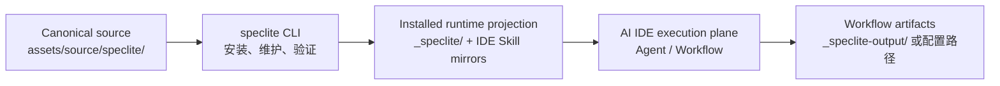

# SpecLite Orientation（SpecLite 入门导览）

本文是一份面向初次接触 SpecLite 的开发者导览。预计阅读时间为 10–15 分钟。读完后，你应能解释 SpecLite 在项目中的作用，区分 Module、Skill、Agent、Workflow 与 Artifact，并知道安装后应该从哪里开始。

如果你准备立即安装，请继续阅读 [`quick-start.md`](quick-start.md)；本文先建立使用 SpecLite 所需的最小心智模型。

## What SpecLite Is（SpecLite 是什么）

SpecLite 是一个 local-first CLI control plane。它把一套可审查的 AI Coding 方法论安装到目标项目的本地文件系统，并负责维护、验证和解释安装状态。

安装完成后，开发者在 Claude Code、Codex 等支持 Skill 发现的 AI IDE 中使用已安装的 Agent 和 Workflow；执行产生的规划、实现、评审与发布证据继续保存在目标项目中。

SpecLite 主要解决三个问题：

1. 把哪些方法论能力安装进项目，并让 AI IDE 能够发现它们。
2. 用可重复的 Workflow 组织分析、规划、方案、实现、评审和发布工作。
3. 让配置、安装投影和 Workflow 产物各自拥有清晰的事实来源与生命周期。

## What SpecLite Is Not（SpecLite 不是什么）

SpecLite 不是：

- 托管研发流程或项目数据的远端服务；它的 control hub、Skill mirrors 和 Workflow artifacts 都位于本地项目。
- Claude Code、Codex 或其他 AI IDE 的替代品；CLI 管理本地运行状态，AI IDE 才是 Agent 和 Workflow 的执行面。
- 项目依赖安装器；选择 React、Java、npm package 等 ecosystem module，只会选择相应 SpecLite Skill package，不会安装框架或语言 runtime。
- 要求所有项目机械走完完整 SDLC 的固定流水线；既有项目、小型修复和完整产品规划可以选择不同入口。
- 自动保证研发质量的黑盒；它能提供流程、门禁与证据，但不能代替团队对需求、设计、代码和发布的判断。

## Big Picture（全景图）

这张图可以简化成一句话：**CLI 把方法论安装并维护在项目中，AI IDE 执行已安装的 Skill，Workflow 把结果写成可审查的 Artifact。**

## Core Concepts（核心概念）

| 概念 | 回答的问题 | 当前表现 | 初学者示例 |
|---|---|---|---|
| Module | 哪些能力应一起安装、配置和索引？ | `core`、`sdlc` 和 optional ecosystem modules。 | 默认安装 `core` + `sdlc`。 |
| Skill | AI IDE 可以发现和加载的自包含能力包是什么？ | 带 `SKILL.md` 的 installed package。 | `speclite-help`、`speclite-create-prd`。 |
| Agent | 由谁以持续角色帮助判断和分发任务？ | 一类 role activation Skill，通常使用 `speclite-agent-*` 名称。 | 激活 PM 或 Architect Agent，先澄清问题再选择 Workflow。 |
| Workflow | 按什么步骤完成一项有输入、产物和验证的任务？ | 一类任务执行 Skill，可包含 `references/`、`assets/` 和 `scripts/`。 | 创建 PRD、生成 Architecture、实现 Story、执行 Code Review。 |
| Artifact | Workflow 实际产生或维护了什么？ | PRD、Architecture、Story、Flow Gate、review report 等文件。 | `_speclite-output/planning-artifacts/prd.md`。 |

这些概念不是同一层级的同义词：Module 是安装组织边界；Skill 是 AI IDE 加载的 package；Agent 与 Workflow 是两类不同职责的 Skill；Artifact 是 Workflow 的执行结果。

## Three Runtime Boundaries（三层运行边界）

使用 SpecLite 时，最重要的边界是不要把 source、runtime 和 artifact 混在一起：

| Layer | 典型路径 | 责任 | 不应该被误认为 |
|---|---|---|---|
| Canonical source | `assets/source/speclite/` | 定义 SpecLite 可以安装的 Module、Skill、Hook 和默认配置。 | 某个目标项目的安装状态。 |
| Installed runtime projection | `_speclite/`、`.claude/skills/`、`.agents/skills/` | 记录 selected modules、配置、索引、Hook 和 AI IDE 执行入口。 | 可独立修改并反向成为 canonical source 的副本。 |
| Workflow artifact repository | `_speclite-output/` 或配置后的路径 | 保存目标项目真实产生的规划、实现、review 和 release 证据。 | installer cache 或可由 `update` 重建的文件。 |

数据流方向是 canonical source → installed runtime projection → Workflow artifacts。`update` 或 `repair` 可以维护 installer-owned projection，但不会把真实研发产物当作安装文件覆盖。

## Default Modules（默认 Module）

默认无交互安装选择：

| Module | 默认状态 | 作用 |
|---|---|---|
| `core` | required | 提供共享配置、帮助、协作、文档与评审基础能力。 |
| `sdlc` | default-selected，依赖 `core` | 提供分析、规划、方案、实现和 DevOps 阶段的 Agent 与 Workflow。 |
| ecosystem modules | 不自动选择 | 提供绑定到特定 language、framework、runtime 或 project shape 的 companion guidance。 |

需要 ecosystem module 时，应在 interactive install 中显式选择。源目录中存在某个 module，不等于目标项目已经安装它；实际 installed-state 以目标项目 manifest 和 indexes 为准。

## Command Map（命令地图）

CLI 命令管理安装状态，不直接替你执行 PRD、Architecture 或 Code Review Workflow：

| 目的 | 命令 | 默认写入行为 |
|---|---|---|
| 确认 CLI 可用 | `command -v speclite`、`speclite --version` | 不写入。 |
| 预检查目标项目 | `speclite install "$PROJECT_ROOT"` | 不写入；只执行 target preflight。 |
| 执行默认安装 | `speclite install "$PROJECT_ROOT" --yes` | 通过 gates 后写入。 |
| 查看轻量状态 | `speclite status "$PROJECT_ROOT"` | 不写入。 |
| 执行完整本地校验 | `speclite validate "$PROJECT_ROOT"` | 不写入。 |
| 查看可用 Module 和 Skill | `speclite list "$PROJECT_ROOT"` | 不写入。 |
| 预览或执行更新 | `speclite update "$PROJECT_ROOT"` / `speclite update "$PROJECT_ROOT" --yes` | 默认只预览；`--yes` 才授权写入。 |
| 深入排查 | `speclite doctor "$PROJECT_ROOT"` | 默认只读取本地 evidence。 |

面向人的默认输出会告诉你 `Outcome`、`Issues` 和 `Next Actions`。脚本或 CI 应增加 `--json` 并读取 `CommandResult`，不要解析 human-readable output。

## First Use Path（第一次使用路径）

下面是一条适合初学者的最短路径：

1. 按 [`quick-start.md`](quick-start.md) 完成安装、`status` 和 `validate`。
2. 在目标项目根目录打开支持 installed Skill 发现的 AI IDE。
3. 调用 installed `speclite-help`，说明当前目标并让它依据本地 catalog、配置和已有产物推荐下一步。
4. 如果任务仍需要角色判断，激活合适的 Agent；如果目标和输入已经明确，直接调用对应 Workflow。
5. 执行后检查 Workflow 报告的输出路径和完成条件，并阅读实际 Artifact，而不是只看对话摘要。

不同 AI IDE 的发现方式、显式调用示例和排错路径见 [`../how-to/use-installed-skills.md`](../how-to/use-installed-skills.md)。

## Choose Your Entry（选择使用入口）

| 你的当前问题 | 推荐入口 |
|---|---|
| “SpecLite 是否正确安装？” | CLI：`status`，必要时 `validate`。 |
| “我不知道下一步应该使用什么。” | installed `speclite-help`。 |
| “我希望某个角色先帮助澄清和判断。” | 对应 Agent。 |
| “目标、输入和期望产物已经明确。” | 直接调用对应 Workflow。 |
| “我要维护 SpecLite 自身的 canonical Skill source。” | maintainer-only support Skill；它不属于默认目标项目安装。 |

更完整的判断规则见 [`../explanation/skill-taxonomy-and-sdlc.md`](../explanation/skill-taxonomy-and-sdlc.md)。

## Learning Path（后续学习路径）

完成本导览后，建议按以下顺序继续：

1. [`quick-start.md`](quick-start.md)：实际安装并验证目标项目。
2. [`../how-to/use-installed-skills.md`](../how-to/use-installed-skills.md)：在 AI IDE 中发现并调用 installed Skill。
3. [`../explanation/skill-taxonomy-and-sdlc.md`](../explanation/skill-taxonomy-and-sdlc.md)：根据任务选择 CLI、Agent 或 Workflow。
4. [`../reference/skills/sdlc-workflows.md`](../reference/skills/sdlc-workflows.md)：按 SDLC 阶段查询具体 Workflow。
5. [`first-brownfield-project.md`](first-brownfield-project.md)：在既有项目中完成第一次端到端实践。
6. [`../reference/workflow-artifact-layout.md`](../reference/workflow-artifact-layout.md)：理解产物位置、producer 和 lifecycle。

## Key Takeaways（关键要点）

- SpecLite CLI 是 local-first control plane，AI IDE 是 installed Skill 的执行面。
- Module 组织安装能力；Skill 是加载单位；Agent 负责角色判断和分发；Workflow 负责执行任务；Artifact 保存执行结果。
- 默认安装是 `core` + `sdlc`，ecosystem module 只在显式选择后进入目标项目。
- canonical source、installed runtime projection 和 Workflow artifacts 必须保持边界清晰。
- 不确定下一步时从 installed `speclite-help` 开始；目标明确时直接使用对应 Workflow。

## Related Documents（相关文档）

| Relationship | Document |
|---|---|
| 成套培训：13 篇材料与验收 | [`speclite-developer-training.md`](speclite-developer-training.md) |
| 下一步：安装与校验 | [`quick-start.md`](quick-start.md) |
| 下一步：调用 installed Skill | [`../how-to/use-installed-skills.md`](../how-to/use-installed-skills.md) |
| 概念：local-first control plane | [`../explanation/local-first-control-plane.md`](../explanation/local-first-control-plane.md) |
| 概念：运行边界 | [`../explanation/runtime-boundaries.md`](../explanation/runtime-boundaries.md) |
| 概念：Skill 分类与 SDLC | [`../explanation/skill-taxonomy-and-sdlc.md`](../explanation/skill-taxonomy-and-sdlc.md) |
| 参考：CLI command surface | [`../reference/cli.md`](../reference/cli.md) |
| 参考：Workflow catalog | [`../reference/skills/sdlc-workflows.md`](../reference/skills/sdlc-workflows.md) |
